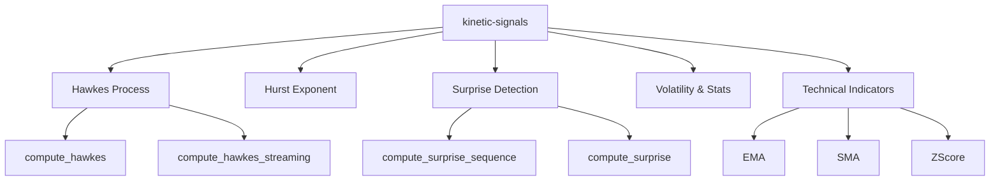
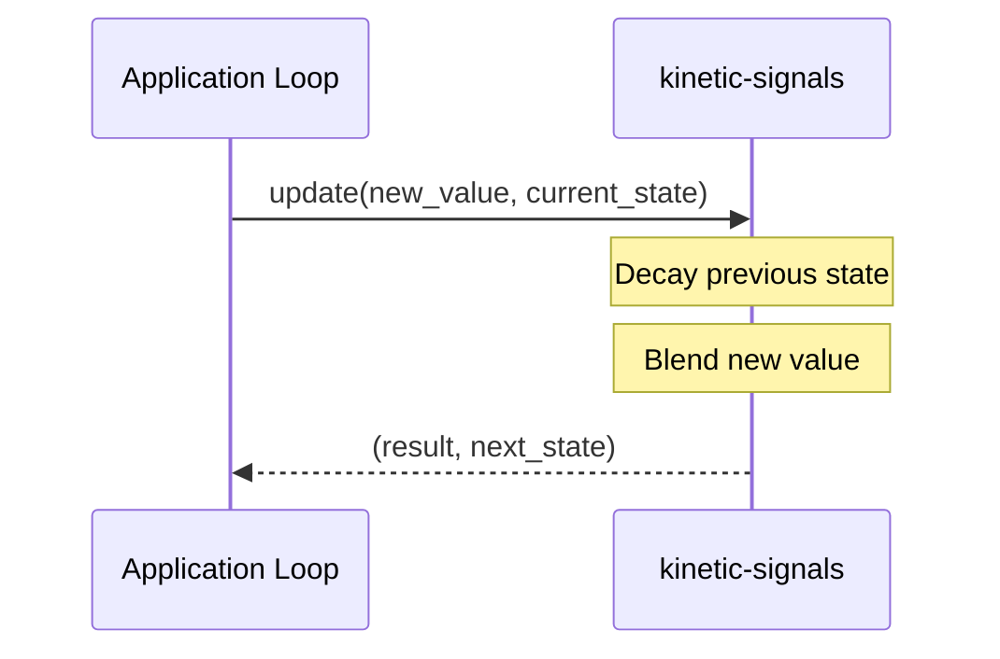

<details>
<summary>Relevant source files</summary>

The following files were used as context for generating this wiki page:

- [README.md](README.md)
- [src/lib.rs](src/lib.rs)
- [AGENTS.md](AGENTS.md)
- [src/hawkes.rs](src/hawkes.rs)
- [src/surprise.rs](src/surprise.rs)
- [src/indicators.rs](src/indicators.rs)
- [src/stats.rs](src/stats.rs)
</details>

# Introduction & Overview

`kinetic-signals` is a high-performance, domain-agnostic Rust library designed for streaming signal feature extraction. It is optimized for real-time inference on high-velocity stochastic time-series data. The crate provides a suite of tools for computing signal statistics, long-memory estimates, point-process intensity, and anomaly detection metrics without assuming a specific application domain.

Sources: [README.md:1-10](README.md#L1-L10), [src/lib.rs:3-10](src/lib.rs#L3-L10), [AGENTS.md:3-5](AGENTS.md#L3-L5)

The project is part of the Limen-Neural ecosystem and serves as a foundational layer for more specialized crates, focusing on generic signal processing rather than specific domains like finance or neurobiology.

Sources: [README.md:195-205](README.md#L195-L205), [AGENTS.md:5-7](AGENTS.md#L5-L7)

## Core Architecture and Features

The library is structured as a collection of specialized modules, each implementing specific signal processing algorithms. It maintains zero required runtime dependencies to ensure portability and performance.



The diagram shows the modular structure of the crate and its primary API entry points for batch and streaming operations.
Sources: [src/lib.rs:35-43](src/lib.rs#L35-L43), [src/lib.rs:75-84](src/lib.rs#L75-L84)

### Principal Modules

| Feature | Module | Description |
| :--- | :--- | :--- |
| **Hurst Exponent** | `hurst` | Detects long-term memory and persistence/anti-persistence in time-series. |
| **Hawkes Process** | `hawkes` | Models self-exciting event clusters using exponential kernels. |
| **Surprise Detection** | `surprise` | Identifies anomalous transitions via normalized log-ratio z-scores. |
| **Signal Stats** | `stats` | Computes high-order moments (Mean, Variance, Skewness, Kurtosis). |
| **Volatility** | `volatility` | Tracks rolling RMS volatility via a ring-buffer `VolEstimator`. |
| **Indicators** | `indicators` | Provides lightweight `EMA`, `SMA`, and `ZScore` normalization. |

Sources: [README.md:13-22](README.md#L13-L22), [src/lib.rs:13-20](src/lib.rs#L13-L20), [AGENTS.md:3-5](AGENTS.md#L3-L5)

## Data Flow & Processing Models

`kinetic-signals` supports two primary processing modes: Batch Processing for historical data analysis and Streaming/Online Updates for real-time signal monitoring.

### Batch Processing Flow
Batch functions typically accept a slice of data (`&[f64]`) and return a result struct containing multiple descriptors.

```mermaid
flowchart TD
    DATA[Input Slice &[f64]] --> FUNC{Algorithm}
    PARAMS[Parameters Struct] --> FUNC
    FUNC --> RES[Result Struct]
    RES --> DESCR[High-order Moments / Intensity / Memory Score]
```

This flowchart illustrates the standard batch processing pattern used by modules like `stats` and `hurst`.
Sources: [src/stats.rs:40-42](src/stats.rs#L40-L42), [src/hawkes.rs:60-65](src/hawkes.rs#L60-L65)

### Streaming Processing Flow
Streaming APIs are designed for O(1) updates, maintaining internal state or requiring the caller to pass back decayed sums.



The sequence diagram demonstrates the state-passing pattern used in the Hawkes streaming API.
Sources: [src/hawkes.rs:133-145](src/hawkes.rs#L133-L145), [src/indicators.rs:44-53](src/indicators.rs#L44-L53)

## Technical Implementation Details

### Performance Benchmarks
The library is optimized for low latency, as evidenced by typical execution times on a Ryzen 9 9950X:
*  **Surprise:** ~100ns
*  **Hawkes (10 events):** ~5μs
*  **Hurst (100 samples):** ~50μs

Sources: [README.md:144-149](README.md#L144-L149), [src/lib.rs:24-28](src/lib.rs#L24-L28)

### Generic Numeric Types
While most APIs default to `f64`, several modules (such as `surprise` and `hurst`) are generic over a `Real` trait to support both `f32` and `f64` calculations.

```rust
pub fn compute_surprise<T>(
    current_value: T,
    previous_value: T,
    params: &SurpriseParams<T>,
) -> SurpriseResult<T>
where
    T: Real,
{
    // ... logic ...
}
```

Sources: [src/surprise.rs:63-68](src/surprise.rs#L63-L68), [README.md:138-142](README.md#L138-L142)

### Observability
The crate includes optional integration with Sentry for error monitoring. This is feature-gated and must be explicitly enabled.

*  **Feature Flag:** `sentry`
*  **Initialization:** `init_sentry()` returns an `Option<ClientInitGuard>` if the `SENTRY_DSN` environment variable is present.

Sources: [src/lib.rs:45-56](src/lib.rs#L45-L56), [AGENTS.md:34-36](AGENTS.md#L34-L36)

## Summary
`kinetic-signals` provides a robust foundation for stochastic signal analysis in Rust. By offering zero-dependency, high-performance implementations of complex algorithms like Hawkes processes and Hurst exponents, it enables developers to build real-time monitoring systems capable of detecting anomalies and patterns in high-velocity data streams.

Sources: [README.md:5-10](README.md#L5-L10), [src/lib.rs:3-10](src/lib.rs#L3-L10)
