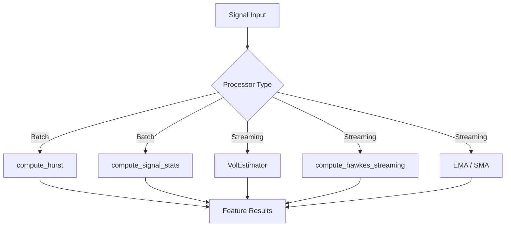
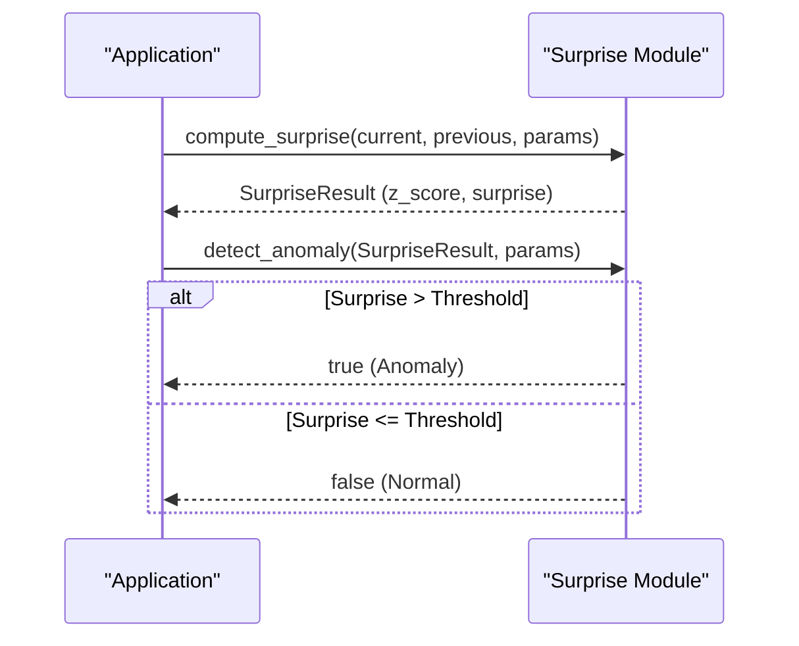

<details>
<summary>Relevant source files</summary>

The following files were used as context for generating this wiki page:

- [README.md](README.md)
- [Cargo.toml](Cargo.toml)
- [examples/demo.rs](examples/demo.rs)
- [AGENTS.md](AGENTS.md)
- [src/lib.rs](src/lib.rs)
- [REVIEW.md](REVIEW.md)
</details>

# Installation & Quick Start

`kinetic-signals` is a high-performance, domain-agnostic Rust library designed for streaming feature extraction from high-velocity stochastic signals. It provides tools for computing signal statistics, point-process intensity, and anomaly detection metrics without requiring external runtime dependencies. Sources: [README.md:1-10](README.md#L1-L10), [src/lib.rs:3-10](src/lib.rs#L3-L10), [AGENTS.md:5-10](AGENTS.md#L5-L10)

The library is part of the Limen-Neural ecosystem and is optimized for real-time inference, featuring execution times ranging from ~100ns for surprise detection to ~50μs for Hurst exponent calculations on modern hardware. Sources: [README.md:132-138](README.md#L132-L138), [src/lib.rs:24-28](src/lib.rs#L24-L28)

## Installation

### Prerequisites
The project requires Rust Edition 2024, which necessitates a Minimum Supported Rust Version (MSRV) of 1.85.0. No additional system dependencies are required for the core library. Sources: [README.md:92](README.md#L92), [AGENTS.md:31-33](AGENTS.md#L31-L33)

### Adding to Project
To include `kinetic-signals` in a Rust project, add the following to the `Cargo.toml` file:

```toml
[dependencies]
kinetic-signals = { git = "https://github.com/Limen-Neural/kinetic-signals%22 }
```

Sources: [README.md:28-32](README.md#L28-L32), [Cargo.toml:1-10](Cargo.toml#L1-L10)

### Feature Flags
The library includes an optional feature for error monitoring:

| Feature | Default | Description |
| :--- | :--- | :--- |
| `sentry` | off | Enables `init_sentry()` and pulls in the `sentry` crate (v0.48.2) for error monitoring. |

Sources: [Cargo.toml:14-19](Cargo.toml#L14-L19), [AGENTS.md:46-48](AGENTS.md#L46-L48)

## Quick Start Logic and Data Flow

The library provides both batch and streaming estimators. The following diagram illustrates the typical data flow for signal processing within the crate.



The diagram shows the transition from raw signal inputs to specific feature extraction modules based on whether the data is processed in batches or as a stream. Sources: [README.md:158-166](README.md#L158-L166), [src/lib.rs:60-70](src/lib.rs#L60-L70), [examples/demo.rs:24-34](examples/demo.rs#L24-L34)

## Core API Usage

### Signal Persistence and Intensity
The library utilizes the Hurst Exponent for memory detection and Hawkes Processes for event clustering.

| Function | Input Type | Return Type | Description |
| :--- | :--- | :--- | :--- |
| `compute_hurst` | `&[T]` | `HurstResult` | Detects long-term memory and persistence. |
| `compute_hawkes` | `&[f64]`, `&HawkesParams` | `HawkesResult` | Models self-exciting event clusters (Batch). |
| `compute_hawkes_streaming` | `f64`, `f64`, `f64`, `&HawkesParams`, `f64` | `(f64, f64)` | Computes intensity updates in O(1) time (Streaming). |

Sources: [README.md:36-50](README.md#L36-L50), [src/lib.rs:60-61](src/lib.rs#L60-L61), [examples/demo.rs:36-105](examples/demo.rs#L36-L105)

### Anomaly Detection (Surprise)
Anomaly detection is implemented via "Surprise" metrics, which use normalized log-ratio z-scores to identify transitions that deviate from expected drift. Sources: [src/lib.rs:18-19](src/lib.rs#L18-L19), [README.md:52-58](README.md#L52-L58)



This sequence illustrates the two-step process of calculating surprise and then validating it against a threshold to detect anomalies. Sources: [README.md:52-58](README.md#L52-L58), [examples/demo.rs:107-130](examples/demo.rs#L107-L130)

## Development Commands

The repository provides several standard commands for building, testing, and verifying the implementation.

| Task | Command |
| :--- | :--- |
| **Build** | `cargo build` |
| **Test** | `cargo test --all-features` |
| **Lint** | `cargo clippy --all-targets --all-features -- -D warnings` |
| **Format** | `cargo fmt --check` |
| **Run Demo** | `cargo run --example demo` |

Sources: [AGENTS.md:35-44](AGENTS.md#L35-L44), [README.md:94-106](README.md#L94-L106), [REVIEW.md:74-85](REVIEW.md#L74-L85)

## Observability Setup

If the `sentry` feature is enabled, the library can be configured to report errors to a Sentry DSN.

1. **Enable Feature**: Add `features = ["sentry"]` to the dependency in `Cargo.toml`.
2. **Set Environment**: `export SENTRY_DSN=https://...@...`
3. **Initialize**: Call `kinetic_signals::init_sentry()` at the start of the application.

```rust
#[cfg(feature = "sentry")]
let _guard = kinetic_signals::init_sentry();
```

The returned guard must be kept alive for the duration of the program to ensure events are flushed (up to 2 seconds). Sources: [src/lib.rs:75-88](src/lib.rs#L75-L88), [README.md:209-222](README.md#L209-L222), [tests/sentry_feature.rs:13-20](tests/sentry_feature.rs#L13-L20)

## Summary

`kinetic-signals` is a specialized Rust library for high-speed signal analysis. It is designed to be self-contained and computationally efficient, making it suitable for real-time systems requiring Hurst exponent analysis, Hawkes process modeling, and surprise-based anomaly detection. The system follows strict thread-safety standards, ensuring all public types are `Send + Sync`. Sources: [src/lib.rs:95-100](src/lib.rs#L95-L100), [AGENTS.md:74](AGENTS.md#L74), [README.md:129-130](README.md#L129-L130)
