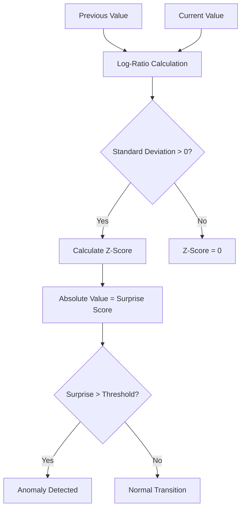

<details>
<summary>Relevant source files</summary>

The following files were used as context for generating this wiki page:

- [README.md](README.md)
- [src/lib.rs](src/lib.rs)
- [src/surprise.rs](src/surprise.rs)
- [REVIEW.md](REVIEW.md)
- [Cargo.toml](Cargo.toml)
- [examples/demo.rs](examples/demo.rs)
</details>

# Upgrading from v0.3.x

The transition from v0.3.x to v0.4.0 in the `kinetic-signals` crate focuses on establishing a domain-agnostic architecture. This update primarily involves the removal of deprecated "GBM" (Geometric Brownian Motion) aliases in favor of generalized "Surprise" detection nomenclature. This change reflects the crate's purpose as a domain-independent tool for streaming signal feature extraction, moving away from terminology specific to financial modeling.

Sources: [README.md:144-148](README.md#L144-L148), [src/surprise.rs:8-14](src/surprise.rs#L8-L14)

## Deprecated Name Mapping

The most significant breaking change in v0.4.0 is the complete removal of the `gbm` module aliases. Developers must replace all instances of the old naming convention with the new surprise-based API.

| Removed (v0.3.x) | Use instead (v0.4.0) | Description |
| :--- | :--- | :--- |
| `compute_gbm_surprise` | `compute_surprise` | Computes surprise for a single transition |
| `compute_gbm_surprise_sequence` | `compute_surprise_sequence` | Processes a vector of values for transitions |
| `GBMParams` | `SurpriseParams` | Configuration for drift, sigma, and thresholds |
| `GBMResult` | `SurpriseResult` | Output structure containing z-scores and log-returns |
| `gbm::detect_anomaly` | `surprise::detect_anomaly` | Boolean check against the configured threshold |

Sources: [README.md:149-158](README.md#L149-L158), [src/surprise.rs:16-43](src/surprise.rs#L16-L43)

## Surprise Detection Logic

The v0.4.0 surprise detection system operates by calculating a normalized "surprise" score for transitions between consecutive positive samples. It calculates the absolute z-score of the observed log-ratio relative to an expected drift (`mu * dt`).



The diagram shows the logic flow for determining if a signal transition is anomalous.
Sources: [src/surprise.rs:11-14](src/surprise.rs#L11-L14), [src/surprise.rs:60-93](src/surprise.rs#L60-L93)

## Migration Example

The following code snippet demonstrates the required changes for migrating from the deprecated v0.3.x style to the v0.4.0 API.

```rust
// v0.4.0 Surprise Detection
use kinetic_signals::{compute_surprise, detect_anomaly, surprise::SurpriseParams};

let params = SurpriseParams {
    mu: 0.0,
    sigma: 0.15,
    dt: 0.001,
    threshold: 3.0,
};

let result = compute_surprise(150.0, 100.0, &params);
if detect_anomaly(&result, &params) {
    // Process anomaly based on result.z_score
}
```

Sources: [examples/demo.rs:139-160](examples/demo.rs#L139-L160), [src/lib.rs:80-82](src/lib.rs#L80-L82)

## Semver and Breaking Changes

Following the project's review guidelines, version 0.4.0 is a minor version bump (`0.3.0` → `0.4.0`) because the project is in a pre-1.0 state. For pre-1.0 releases, breaking changes like the removal of the GBM aliases are handled through minor version increments.

*  **Version Bump:** Pre-1.0 minor `0.X.0` → `0.(X+1).0`.
*  **Documentation:** Migration guides must be added to the README (fulfilled in v0.4.0).
*  **Toolchain:** Ensure your environment uses Rust >= 1.85 (Edition 2024), which is the MSRV for v0.4.0.

Sources: [REVIEW.md:71-74](REVIEW.md#L71-L74), [Cargo.toml:3-5](Cargo.toml#L3-L5), [AGENTS.md:46-48](AGENTS.md#L46-L48)

## Conclusion

Upgrading to v0.4.0 requires updating all surprise detection types and functions. While the underlying logic for calculating normalized surprise remains consistent with previous versions, the rename is a critical step in the crate's mission to remain a domain-agnostic primitive for stochastic time-series analysis.

Sources: [README.md:144-158](README.md#L144-L158), [src/surprise.rs:8-14](src/surprise.rs#L8-L14)
