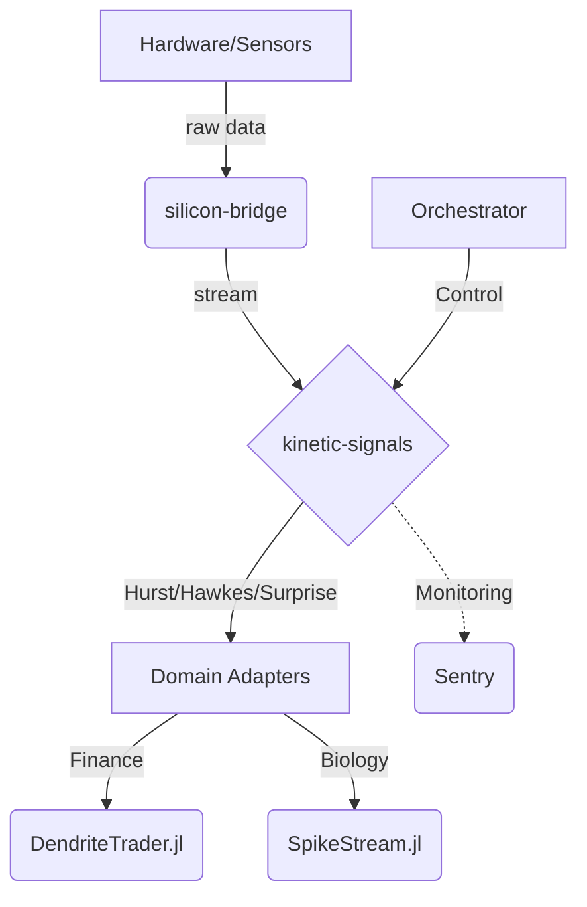
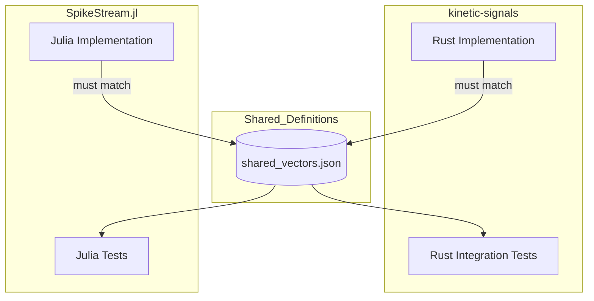

<details>
<summary>Relevant source files</summary>

The following files were used as context for generating this wiki page:

- [README.md](README.md)
- [AGENTS.md](AGENTS.md)
- [REVIEW.md](REVIEW.md)
- [src/lib.rs](src/lib.rs)
- [Cargo.toml](Cargo.toml)
</details>

# Scope & Ownership Boundaries

The `kinetic-signals` crate is designed as a high-performance, domain-agnostic Rust library for streaming signal feature extraction. Its primary purpose is to provide mathematical primitives for stochastic time-series analysis, including point-process intensity, anomaly detection, and signal statistics, while remaining independent of specific application domains like finance or neurobiology.

Sources: [README.md:12-21](README.md#L12-L21), [AGENTS.md:3-5](AGENTS.md#L3-L5), [src/lib.rs:3-12](src/lib.rs#L3-L12)

## Architectural Ownership

The project explicitly defines what belongs within the crate versus what should be handled by neighboring repositories in the [Limen-Neural](https://github.com/Limen-Neural) ecosystem. `kinetic-signals` owns the core mathematical logic for feature extraction but does not own data acquisition, specialized domain adapters, or high-level orchestration.

### Domain Boundaries
The following table outlines the strict separation of concerns for this crate.

| Feature Area | Ownership Status | External Target Repository |
| :--- | :--- | :--- |
| Generic Signal Statistics | **In-Scope** | N/A |
| Anomaly Detection Primitives | **In-Scope** | N/A |
| Spike-train Analysis | Out-of-Scope | SpikeStream.jl |
| SNN Runtime / Neuron Models | Out-of-Scope | neuromod |
| Financial Domain Adapters | Out-of-Scope | DendriteTrader.jl / metabolic-ledger |
| Hardware Signal Acquisition | Out-of-Scope | silicon-bridge |
| Supervisory Orchestration | Out-of-Scope | brainstem-daemon |

Sources: [README.md:205-213](README.md#L205-L213), [AGENTS.md:5-7](AGENTS.md#L5-L7), [REVIEW.md:92-101](REVIEW.md#L92-L101)

### Data Flow and System Relationships
The diagram below illustrates how `kinetic-signals` acts as a pure processing layer within the broader ecosystem.



The diagram shows `kinetic-signals` receiving data from acquisition layers and providing generic features to specialized domain consumers.
Sources: [README.md:205-213](README.md#L205-L213), [REVIEW.md:92-101](REVIEW.md#L92-L101), [src/lib.rs:55-75](src/lib.rs#L55-L75)

## Module Boundaries

The crate is organized into several public modules, each owning a specific mathematical or statistical domain.

### Core Signal Features
*  **Hurst Exponent (`hurst`):** Ownership of long-term memory and persistence detection in time-series.
*  **Hawkes Process (`hawkes`):** Ownership of self-exciting point-process intensity modeling.
*  **Surprise (`surprise`):** Ownership of anomalous transition magnitude detection via z-scores.
*  **Volatility (`volatility`):** Ownership of real-time variance and standard deviation tracking.
*  **Entropy (`entropy`):** Ownership of Shannon entropy and information density measurements.
*  **Indicators (`indicators`):** Ownership of common moving averages (EMA, SMA) and normalization helpers.

Sources: [src/lib.rs:33-41](src/lib.rs#L33-L41), [README.md:23-33](README.md#L23-L33)

### Cross-Language Parity
To ensure consistency across the ecosystem, `kinetic-signals` maintains parity with `SpikeStream.jl`. This boundary is enforced via shared test vectors.



The diagram represents the shared dependency on `shared_vectors.json` to maintain output parity across different language implementations.
Sources: [README.md:167-185](README.md#L167-L185), [AGENTS.md:12-14](AGENTS.md#L12-L14), [AGENTS.md:86-90](AGENTS.md#L86-L90)

## Internal vs. External Dependencies

`kinetic-signals` follows a "zero required dependencies" philosophy to maintain a lightweight footprint and high portability.

*  **Runtime Dependencies:** None by default. The crate is self-contained.
*  **Optional Features:** Sentry integration is the only optional runtime dependency, used for error monitoring.
*  **Dev Dependencies:** Tools for testing (e.g., `serde_json`, `temp-env`, `serial_test`) and CI/CD.

Sources: [Cargo.toml:13-25](Cargo.toml#L13-L25), [AGENTS.md:21-33](AGENTS.md#L21-L33), [README.md:220-230](README.md#L220-L230)

## Maintenance and Review Scope

Ownership boundaries also extend to code maintenance. The `REVIEW.md` file explicitly defines what is in-scope for code reviews and bot monitoring.

### Reviewable Assets
| Path | Responsibility |
| :--- | :--- |
| `src/` | API design, performance, and correctness. |
| `tests/` | Cross-language parity and edge cases. |
| `docs/` | Architectural consistency (Boundary Matrix). |
| `Cargo.toml` | Feature gates and dependency hygiene. |

Sources: [REVIEW.md:7-22](REVIEW.md#L7-L22)

### Out-of-Scope Assets
*  **Local Tooling:** IDE configurations (`.vscode`, `.cursor`).
*  **Generated Artifacts:** `Cargo.lock` (as it is a library crate), build artifacts.
*  **Metadata:** License text files (unless policy changes).

Sources: [REVIEW.md:24-28](REVIEW.md#L24-L28), [AGENTS.md:104-105](AGENTS.md#L104-L105)

## Thread Safety Ownership
All public types in the crate are required to implement `Send + Sync`. This is a strict architectural boundary enforced via compile-time assertions in `src/lib.rs`.

```rust
fn _assert_send_sync() {
    fn assert_send_sync<T: Send + Sync>() {}
    assert_send_sync::<VolEstimator>();
    assert_send_sync::<HurstResult>();
    assert_send_sync::<HawkesResult>();
    assert_send_sync::<surprise::SurpriseResult>();
    // ... additional types
}
```

Sources: [src/lib.rs:94-111](src/lib.rs#L94-L111)

## Conclusion
The scope of `kinetic-signals` is strictly limited to the efficient, thread-safe, and generic extraction of signal features. By delegating domain-specific logic to external crates and maintaining a zero-dependency core, it serves as a foundational building block for larger stochastic signal processing systems within the Limen-Neural ecosystem.
