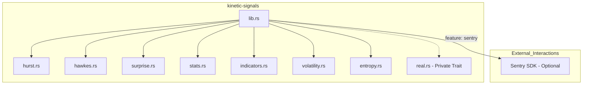
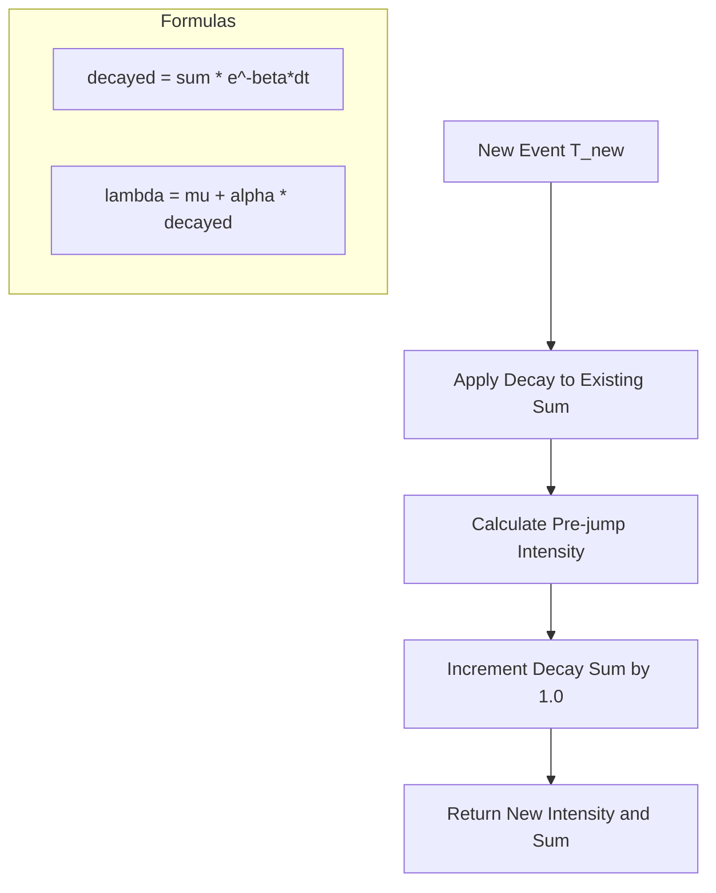
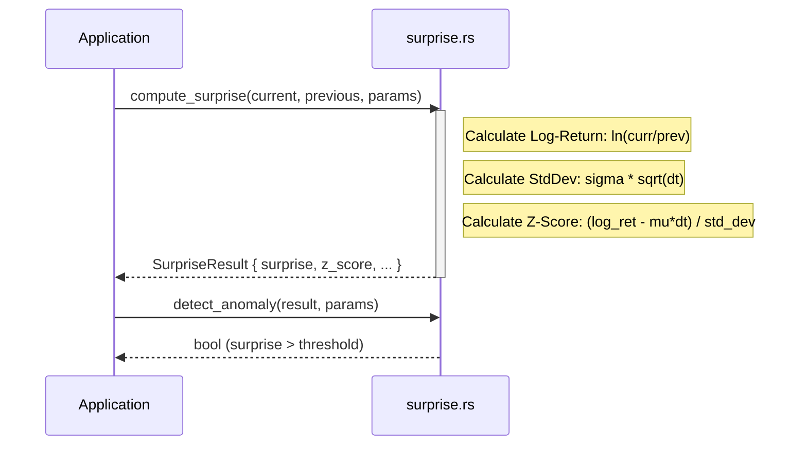

<details>
<summary>Relevant source files</summary>

The following files were used as context for generating this wiki page:

- [src/lib.rs](src/lib.rs)
- [AGENTS.md](AGENTS.md)
- [README.md](README.md)
- [src/hawkes.rs](src/hawkes.rs)
- [src/surprise.rs](src/surprise.rs)
- [src/indicators.rs](src/indicators.rs)
- [src/volatility.rs](src/volatility.rs)
</details>

# System Architecture

The `kinetic-signals` crate is a high-performance, domain-agnostic Rust library designed for streaming signal feature extraction. Its primary purpose is to compute statistics, point-process intensity, and anomaly metrics on high-velocity stochastic time-series data. The architecture emphasizes zero runtime dependencies, thread-safety, and aggressive optimization for real-time inference.

Sources: [README.md:5-15](README.md#L5-L15), [AGENTS.md:5-10](AGENTS.md#L5-L10), [src/lib.rs:5-15](src/lib.rs#L5-L15)

## Module Structure and Public API

The library is organized into specialized modules, each responsible for a specific type of signal analysis or indicator. The `prelude` module provides a convenient entry point for consuming the library's primary data structures and functions.



The architecture separates batch processing logic from streaming/online updates to support both historical analysis and real-time monitoring.
Sources: [src/lib.rs:25-33](src/lib.rs#L25-L33), [AGENTS.md:14-25](AGENTS.md#L14-L25)

### Core Components Summary

| Component | Responsibility | Relevant Files |
| :--- | :--- | :--- |
| **Hurst Exponent** | Detects long-term memory and persistence | `src/hurst.rs`, `src/lib.rs` |
| **Hawkes Process** | Models self-exciting event clusters | `src/hawkes.rs`, `src/lib.rs` |
| **Surprise** | Detects anomalous transition magnitudes | `src/surprise.rs`, `src/lib.rs` |
| **Indicators** | Provides EMA, SMA, and Z-Score normalization | `src/indicators.rs` |
| **Volatility** | Tracks rolling RMS of absolute log-returns | `src/volatility.rs` |
| **Signal Stats** | Computes high-order moments (Skewness, Kurtosis) | `src/stats.rs` |

Sources: [README.md:17-27](README.md#L17-L27), [src/lib.rs:8-18](src/lib.rs#L8-L18)

## Point-Process Intensity (Hawkes)

The Hawkes module implements models for self-exciting event streams. It supports two main modes of operation: batch estimation via `compute_hawkes` and $O(1)$ online updates via `compute_hawkes_streaming`.

### Hawkes Logic Flow
The streaming implementation maintains a `decay_sum` to avoid re-calculating the entire history for every new event.



Sources: [src/hawkes.rs:104-128](src/hawkes.rs#L104-L128), [src/hawkes.rs:65-80](src/hawkes.rs#L65-L80)

### Hawkes Parameters
The behavior of the process is governed by the `HawkesParams` structure:
- `mu`: Baseline intensity.
- `alpha`: Excitation amplitude added by each event.
- `beta`: Exponential decay rate.

Sources: [src/hawkes.rs:35-42](src/hawkes.rs#L35-L42)

## Surprise and Anomaly Detection

The Surprise module detects anomalous transitions between consecutive positive samples. It calculates a normalized "surprise" score based on the absolute z-score of the observed log-ratio relative to an expected drift.



Sources: [src/surprise.rs:65-95](src/surprise.rs#L65-L95), [src/surprise.rs:118-124](src/surprise.rs#L118-L124)

## Streaming Indicators and Volatility

The indicators module provides allocation-conscious estimators for high-velocity updates. `EMA` (Exponential Moving Average) and `SMA` (Simple Moving Average) are implemented as structs that maintain internal state.

### Indicators Data Structure
- **EMA**: Uses a smoothing factor $\alpha = 2 / (period + 1)$.
- **SMA**: Uses a fixed-capacity `Vec<f64>` as a ring-buffer to maintain $O(capacity)$ memory.
- **VolEstimator**: Specifically designed for absolute log-returns, computing rolling RMS volatility.

Sources: [src/indicators.rs:27-57](src/indicators.rs#L27-L57), [src/indicators.rs:98-124](src/indicators.rs#L98-L124), [src/volatility.rs:10-25](src/volatility.rs#L10-L25)

## Observability and Error Monitoring

The system includes an optional integration with Sentry for error monitoring. This is gated behind the `sentry` feature flag and is only initialized if the `SENTRY_DSN` environment variable is present.

```rust
#[cfg(feature = "sentry")]
pub fn init_sentry() -> Option<sentry::ClientInitGuard> {
    match std::env::var("SENTRY_DSN") {
        Ok(dsn) if !dsn.is_empty() => {
            let guard = sentry::init((
                dsn,
                sentry::ClientOptions {
                    release: sentry::release_name!(),
                    ..Default::default()
                },
            ));
            Some(guard)
        }
        _ => None,
    }
}
```

Sources: [src/lib.rs:50-68](src/lib.rs#L50-L68), [AGENTS.md:65-72](AGENTS.md#L65-L72)

## Thread Safety and Generics

The architecture ensures that all public types are `Send + Sync` to support multi-threaded signal processing environments. Furthermore, key components like `SurpriseParams` and `SurpriseResult` are generic over a `Real` trait (implemented for `f32` and `f64`) to support different numeric precisions.

Sources: [src/lib.rs:101-118](src/lib.rs#L101-L118), [src/surprise.rs:26-45](src/surprise.rs#L26-L45), [src/real.rs:5-23](src/real.rs#L5-L23)
