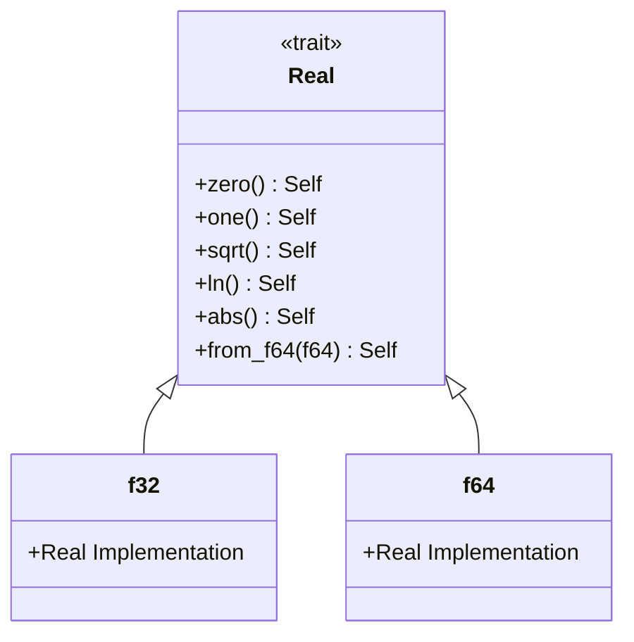
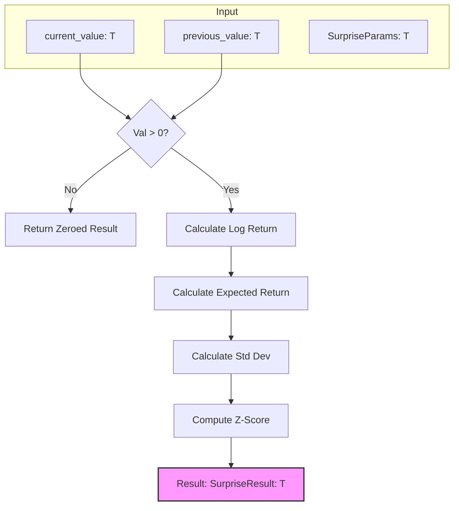

Relevant source files

The following files were used as context for generating this wiki page:

- [src/real.rs](src/real.rs)
- [src/lib.rs](src/lib.rs)
- [README.md](README.md)
- [src/hurst.rs](src/hurst.rs)
- [src/surprise.rs](src/surprise.rs)
- [src/volatility.rs](src/volatility.rs)

# Numeric Types & The Real Trait

The `kinetic-signals` crate employs a flexible numeric architecture designed to support high-performance signal processing across different floating-point precisions. At the core of this architecture is the `Real` trait, a private abstraction that allows core algorithms—such as Hurst exponent estimation and surprise detection—to remain generic over `f32` and `f64` types.

While most high-level APIs default to `f64` for maximum precision, the underlying implementation uses the `Real` trait to ensure code reusability and type safety. This design allows developers to choose between the memory efficiency of `f32` and the numerical stability of `f64` depending on their specific hardware and performance requirements.

Sources: [README.md:104-106](README.md#L104-L106), [src/lib.rs:34-40](src/lib.rs#L34-L40), [src/real.rs:3-10](src/real.rs#L3-L10)

## The Real Trait

The `Real` trait is defined in `src/real.rs` and serves as a internal contract for numeric types capable of performing signal analysis. It encapsulates standard arithmetic operations alongside specialized mathematical functions required for stochastic modeling.

### Trait Definition & Requirements
The trait requires types to implement `Copy`, `PartialOrd`, and the four basic arithmetic operators (`Add`, `Sub`, `Mul`, `Div`). Additionally, it defines a set of required methods for constant generation and advanced math.

| Method | Description |
|--------|-------------|
| `zero()` | Returns the additive identity (0.0). |
| `one()` | Returns the multiplicative identity (1.0). |
| `from_f64(value)` | Converts an `f64` literal to the target type. |
| `from_usize(value)` | Converts a `usize` (typically a count) to the target type. |
| `sqrt()` | Computes the square root. |
| `ln()` | Computes the natural logarithm. |
| `abs()` | Computes the absolute value. |
| `powi(n)` | Raises the value to an integer power. |
| `max(other)` / `min(other)` | Returns the maximum or minimum of two values. |

Sources: [src/real.rs:3-20](src/real.rs#L3-L20)

### Implementation for Standard Types
The crate provides implementations of `Real` for both `f32` and `f64`. This allows the library to bridge the gap between low-level arithmetic and high-level generic algorithms.

The diagram above shows the relationship between the `Real` trait and the standard Rust floating-point types.

Sources: [src/real.rs:22-86](src/real.rs#L22-L86)

## Generic Algorithm Integration

Several key modules in `kinetic-signals` utilize the `Real` trait to provide generic implementations. This pattern is primarily seen in modules requiring complex mathematical transforms where the choice of precision impacts performance (e.g., `Hurst` and `Surprise`).

### Hurst Exponent
The `compute_hurst` function is generic over `T: Real`. It uses the trait to perform R/S analysis, including mean subtraction, cumulative deviation, and log-log linear regression. The result is returned as a `HurstResult<T>`, maintaining the input's precision.

Sources: [src/hurst.rs:25-46](src/hurst.rs#L25-L46), [src/hurst.rs:52-54](src/hurst.rs#L52-L54)

### Surprise Detection
The surprise detection system uses `Real` to calculate log-ratios and z-scores. The `SurpriseParams<T>` and `SurpriseResult<T>` structures are generic, allowing the detector to operate on different numeric types seamlessly.

This flowchart illustrates the data flow within the generic `compute_surprise` function, where `T` is constrained by the `Real` trait.

Sources: [src/surprise.rs:21-41](src/surprise.rs#L21-L41), [src/surprise.rs:60-70](src/surprise.rs#L60-L70)

## Type Usage Summary

While the `Real` trait provides genericity, different modules have specific default behaviors or requirements as summarized below:

| Module | Primary Type | Genericity | Notes |
|--------|--------------|------------|-------|
| **Hurst** | `f64` (default) | Yes (`T: Real`) | Supports `f32` for large batch processing. |
| **Surprise** | `f64` (default) | Yes (`T: Real`) | All params and results follow the input type. |
| **Hawkes** | `f64` | No | Point process intensity typically requires `f64`. |
| **Volatility** | `f32` / `f64` | Mixed | `VolEstimator` pushes `f32` log-returns but can compute `f64`. |
| **Stats** | `f64` | No | Higher-order moments use `f64` for stability. |

Sources: [README.md:104-106](README.md#L104-L106), [src/volatility.rs:30](src/volatility.rs#L30), [src/stats.rs:13](src/stats.rs#L13), [src/lib.rs:86-100](src/lib.rs#L86-L100)

## Thread Safety and Constraints

To ensure reliability in multi-threaded streaming environments, all public types associated with these numeric operations are verified at compile-time to implement `Send + Sync`. This includes the generic results of the `Real`-based algorithms.

Sources: [src/lib.rs:86-100](src/lib.rs#L86-L100)

## Conclusion

The use of the `Real` trait in `kinetic-signals` provides a robust foundation for technical and stochastic analysis. By abstracting the core mathematical operations, the crate maintains a high degree of internal consistency while offering users the flexibility to choose the appropriate numeric precision for their specific signal processing tasks. This architecture ensures that performance-critical components like Hurst and Surprise can be optimized for different hardware targets without duplicating logic.
