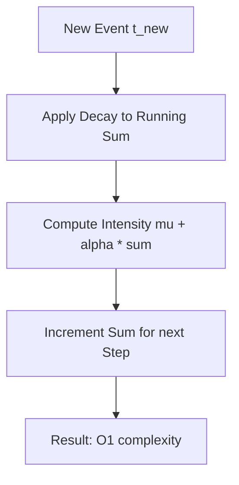
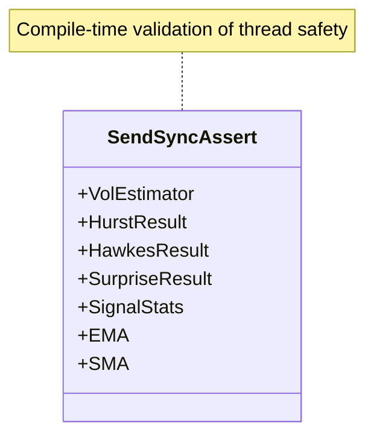

<details>
<summary>Relevant source files</summary>

The following files were used as context for generating this wiki page:

- [README.md](README.md)
- [src/lib.rs](src/lib.rs)
- [src/hawkes.rs](src/hawkes.rs)
- [src/stats.rs](src/stats.rs)
- [src/indicators.rs](src/indicators.rs)
- [src/volatility.rs](src/volatility.rs)
- [Cargo.toml](Cargo.toml)
</details>

# Performance Optimizations

`kinetic-signals` is a high-performance Rust library designed for real-time feature extraction from high-velocity stochastic signals. The architecture prioritizes low-latency execution and minimal resource overhead to support high-frequency event streams. The library achieves this through O(1) online update algorithms, zero-dependency runtime, and aggressive compiler optimizations.

Sources: [README.md:10-12](README.md#L10-L12), [src/lib.rs:5-10](src/lib.rs#L5-L10), [Cargo.toml:34-37](Cargo.toml#L34-L37)

## Real-Time Latency Profiles

The library is benchmarked on modern hardware (Ryzen 9 9950X) to ensure predictable performance for real-time inference. Typical execution times are measured in microseconds and nanoseconds:

| Feature | Complexity / Scale | Latency |
| :--- | :--- | :--- |
| **Hurst Exponent** | 100 samples | ~50μs |
| **Hawkes Process** | 10 events | ~5μs |
| **Surprise Detection** | Single transition | ~100ns |

Sources: [README.md:92-97](README.md#L92-L97), [src/lib.rs:24-28](src/lib.rs#L24-L28)

## Algorithmic Optimizations

### O(1) Streaming Updates
For high-velocity point processes, `kinetic-signals` implements online estimators that avoid re-processing the entire signal history. The `compute_hawkes_streaming` function maintains a running decayed event-sum, allowing for O(1) intensity updates regardless of the number of past events.



The diagram shows the logic flow for a single streaming update, highlighting how complexity remains constant by using the previous state.

Sources: [src/hawkes.rs:101-106](src/hawkes.rs#L101-L106), [src/hawkes.rs:136-150](src/hawkes.rs#L136-L150)

### Allocation-Conscious Indicators
Technical indicators such as `EMA` and `SMA` are designed to be lightweight and allocation-conscious. The `SMA` (Simple Moving Average) implementation uses a fixed-capacity window where the oldest sample is dropped as new ones arrive, keeping memory usage constant at \( O(\text{capacity}) \).

Sources: [src/indicators.rs:6-12](src/indicators.rs#L6-L12), [src/indicators.rs:96-102](src/indicators.rs#L96-L102)

### Single and Two-Pass Batch Processing
For batch statistics, the library employs minimized pass counts to reduce cache misses:
*  **Signal Statistics:** `compute_signal_stats` uses a two-pass approach. One pass computes the mean, and the second pass computes high-order moments (variance, skewness, kurtosis) in a single loop.
*  **Volatility:** `VolEstimator` tracks rolling RMS volatility via a ring-buffer, avoiding full re-calculations of signal power.

Sources: [src/stats.rs:7-12](src/stats.rs#L7-L12), [src/stats.rs:43-62](src/stats.rs#L43-L62), [README.md:20](README.md#L20)

## Compilation and Dependency Management

### Zero-Dependency Runtime
The core library has zero required runtime dependencies, ensuring a minimal binary footprint and fast link times. Optional features like error monitoring via Sentry are feature-gated and do not impact the default build.

Sources: [README.md:14](README.md#L14), [Cargo.toml:16-25](Cargo.toml#L16-L25)

### Release Profile Configuration
The crate uses aggressive Link Time Optimization (LTO) and codegen settings in the release profile to maximize throughput:

```toml
[profile.release]
opt-level = 3
lto = true
codegen-units = 1
```

Sources: [Cargo.toml:34-38](Cargo.toml#L34-L38)

### Thread Safety and Concurrency
Public types are validated at compile-time to be `Send + Sync`. This ensures that the signal extraction components can be safely distributed across multiple threads in high-throughput supervisory orchestration systems without introducing synchronization bottlenecks.



Sources: [src/lib.rs:78-98](src/lib.rs#L78-L98)

## Summary
Performance optimizations in `kinetic-signals` center on minimizing computational complexity through streaming algorithms and maximizing hardware utilization through Rust's zero-cost abstractions and optimized release profiles. These design choices make it suitable for high-frequency signal acquisition and real-time anomaly detection.
