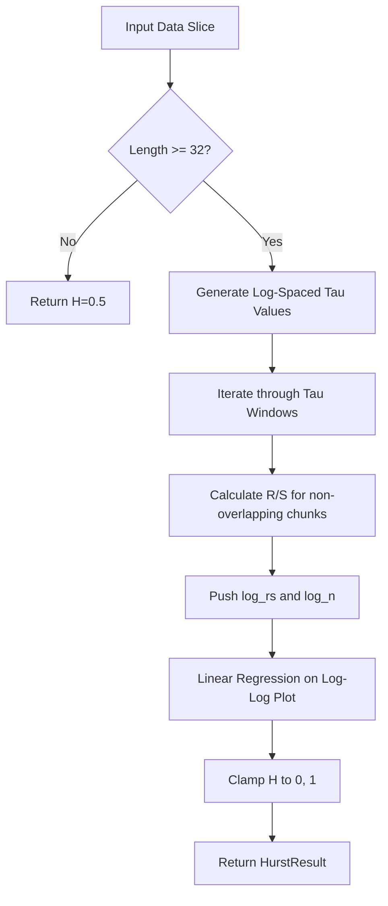

<details>
<summary>Relevant source files</summary>

The following files were used as context for generating this wiki page:

- [src/hurst.rs](src/hurst.rs)
- [README.md](README.md)
- [src/lib.rs](src/lib.rs)
- [examples/demo.rs](examples/demo.rs)
- [tests/fixtures/shared_vectors.json](tests/fixtures/shared_vectors.json)
- [tests/cross_language_ranges.rs](tests/cross_language_ranges.rs)
</details>

# Hurst Exponent Detection

Hurst Exponent Detection is a feature within the `kinetic-signals` crate used to characterize the long-range dependence and memory of a stochastic time-series. By estimating the Hurst exponent ($H \in [0, 1]$), the system identifies whether a signal is persistent (trending), anti-persistent (mean-reverting), or uncorrelated (random walk). This detection is critical for analyzing high-velocity signals where long-term memory effects influence future state probabilities.

Sources: [README.md:14](README.md#L14), [src/hurst.rs:3-12](src/hurst.rs#L3-L12), [src/lib.rs:8-15](src/lib.rs#L8-L15)

## Core Logic and Estimation Process

The implementation utilizes **Rescaled-Range (R/S) Analysis**. The algorithm processes a dataset by dividing it into various window sizes (represented by $\tau$) to observe how the range of cumulative deviations scales with the window size. A linear regression is then performed on a log-log plot of these R/S values against the window sizes; the slope of this regression represents the estimated Hurst exponent.

Sources: [src/hurst.rs:16-19](src/hurst.rs#L16-L19), [src/hurst.rs:84-118](src/hurst.rs#L84-L118)

### R/S Calculation Flow
The following diagram illustrates the internal data flow of the `compute_hurst` function as it processes input data to generate an estimate.



The system requires a minimum of 32 samples to perform an estimate. For shorter series, it returns a default value of $0.5$ without setting any persistence flags.

Sources: [src/hurst.rs:55-63](src/hurst.rs#L55-L63), [src/hurst.rs:66-74](src/hurst.rs#L66-L74)

## Data Structures and API

The Hurst detection API is exposed through the `compute_hurst` function and the `HurstResult` struct. The implementation is generic over the scalar type `T`, supporting both `f32` and `f64`.

Sources: [src/hurst.rs:23-25](src/hurst.rs#L23-L25), [src/hurst.rs:52-54](src/hurst.rs#L52-L54), [src/lib.rs:72](src/lib.rs#L72)

### HurstResult Fields
| Field | Type | Description |
| :--- | :--- | :--- |
| `h` | `T` | The estimated exponent, clamped to the range $[0, 1]$. |
| `is_persistent` | `bool` | True if $H > 0.52$, indicating trending behavior. |
| `is_antipersistent` | `bool` | True if $H < 0.48$, indicating mean-reverting behavior. |

Sources: [src/hurst.rs:25-32](src/hurst.rs#L25-L32), [tests/fixtures/shared_vectors.json:69](tests/fixtures/shared_vectors.json#L69)

### Technical Constraints
- **Minimum Buffer:** The algorithm applies a small buffer (0.02) around the $0.5$ mark to avoid noise in random-walk detection. $H \approx 0.5$ is treated as uncorrelated.
- **Window Scaling:** $\tau$ values are generated using a factor of 1.4, starting from 8 up to $n/2$, with a maximum of 30 log-spaced values to ensure efficient scale coverage.
- **Precision:** Linear regression ignores denominators near zero (absolute value $< 1e-12$) to maintain numerical stability.

Sources: [src/hurst.rs:67-73](src/hurst.rs#L67-L73), [src/hurst.rs:114-122](src/hurst.rs#L114-L122), [src/hurst.rs:125-127](src/hurst.rs#L125-L127)

## Implementation Details

The core calculation involves finding the mean, cumulative deviations, and standard deviations for non-overlapping chunks within each window size $\tau$.

```rust
// Calculation logic from src/hurst.rs:91-105
for &x in chunk {
    let diff = x - mean;
    cumdev = cumdev + diff;
    max_dev = max_dev.max(cumdev);
    min_dev = min_dev.min(cumdev);
    sq_diff_sum = sq_diff_sum + diff * diff;
}

let std_dev = (sq_diff_sum / T::from_usize(tau)).sqrt();
if std_dev > c(1e-12) {
    rs_sums = rs_sums + (max_dev - min_dev) / std_dev;
    count += 1;
}
```

Sources: [src/hurst.rs:91-105](src/hurst.rs#L91-L105)

## Integration and Performance

The feature is designed for high-performance streaming environments. On a Ryzen 9 9950X, a 100-sample Hurst calculation typically executes in approximately $50\mu s$.

Sources: [README.md:118](README.md#L118), [src/lib.rs:21](src/lib.rs#L21)

### Cross-Language Parity
To ensure consistency with `SpikeStream.jl`, the Rust implementation is validated against shared test vectors. These tests confirm that the output `h` remains strictly within the $[0, 1]$ interval.

Sources: [README.md:131-137](README.md#L131-L137), [tests/cross_language_ranges.rs:51-68](tests/cross_language_ranges.rs#L51-L68)

Hurst Exponent Detection provides a robust mechanism for identifying memory structures in stochastic signals, distinguishing between trending, mean-reverting, and purely random data through rescaled-range analysis.
