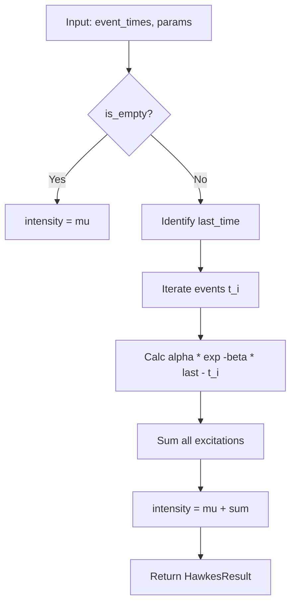
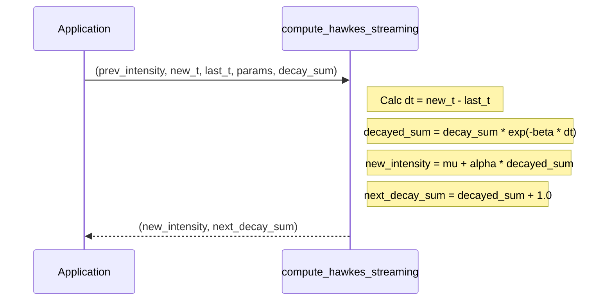

<details>
<summary>Relevant source files</summary>

The following files were used as context for generating this wiki page:

- [src/hawkes.rs](src/hawkes.rs)
- [README.md](README.md)
- [src/lib.rs](src/lib.rs)
- [examples/demo.rs](examples/demo.rs)
- [tests/hawkes_fixture_vectors.rs](tests/hawkes_fixture_vectors.rs)
- [tests/fixtures/shared_vectors.json](tests/fixtures/shared_vectors.json)
</details>

# Hawkes Process Modeling

Hawkes Process modeling within the `kinetic-signals` crate provides tools for estimating the intensity of self-exciting point processes. This mathematical framework models event streams where the occurrence of an event temporarily increases the probability of future events, a phenomenon known as self-excitation. It is a critical component for analyzing high-velocity stochastic time-series such as trade executions, neural spikes, or social media interactions.

The implementation offers both batch estimation for historical data analysis and high-performance O(1) online updates for real-time streaming inference. This module is part of a larger ecosystem focused on domain-agnostic signal feature extraction, supporting consistent results across different programming environments through shared test vectors.
Sources: [README.md:9-12](README.md#L9-L12), [src/hawkes.rs:3-16](src/hawkes.rs#L3-L16), [src/lib.rs:5-15](src/lib.rs#L5-L15)

## Mathematical Model

The conditional intensity $\lambda(t)$ at time $t$ is defined as:
$$\lambda(t) = \mu + \sum_{t_i \le t} \alpha\, e^{-\beta (t - t_i)}$$
Where:
- $\mu$: Baseline (immigrant) intensity.
- $\alpha$: Excitation amplitude added by each event.
- $\beta$: Exponential decay rate of the excitation.
- $t_i$: Timestamps of past events.

Sources: [src/hawkes.rs:8-12](src/hawkes.rs#L8-L12)

## Core Components and Data Structures

The system relies on a set of parameters to define the process behavior and a specific structure to return estimation results.

### HawkesParams
The `HawkesParams` struct defines the behavior of the exponential-kernel process.

| Field | Type | Description | Default Value |
| :--- | :--- | :--- | :--- |
| `mu` | `f64` | Baseline (immigrant) intensity $\mu \ge 0$. | 0.1 |
| `alpha` | `f64` | Excitation amplitude $\alpha \ge 0$ added by each event. | 0.5 |
| `beta` | `f64` | Exponential decay rate $\beta > 0$. | 1.0 |
| `dt` | `f64` | Nominal time step (retained for API stability). | 0.001 |

Sources: [src/hawkes.rs:33-49](src/hawkes.rs#L33-L49), [tests/fixtures/shared_vectors.json:88-93](tests/fixtures/shared_vectors.json#L88-L93)

### HawkesResult
The result of an intensity estimate, whether batch or streaming.

| Field | Type | Description |
| :--- | :--- | :--- |
| `intensity` | `f64` | Conditional intensity $\lambda(t)$ at the last event time. |
| `event_count` | `usize` | Number of events in the input history. |
| `avg_excitation` | `f64` | Mean per-event excitation contribution. |

Sources: [src/hawkes.rs:24-30](src/hawkes.rs#L24-L30)

## Implementation Strategies

The crate provides two primary interfaces for intensity estimation: batch processing and O(1) streaming updates.

### Batch Estimation
The `compute_hawkes` function calculates the post-event intensity from a full history of event times. It iterates through the provided slice, applying the exponential decay relative to the most recent event time.



Sources: [src/hawkes.rs:54-85](src/hawkes.rs#L54-L85)

### Streaming Estimation
For real-time applications, `compute_hawkes_streaming` provides O(1) updates by maintaining a running "decayed sum" of events. This avoids re-scanning the entire event history.



Sources: [src/hawkes.rs:114-131](src/hawkes.rs#L114-L131), [examples/demo.rs:107-133](examples/demo.rs#L107-L133)

## Technical Performance and Parity

The Hawkes Process module is optimized for high-velocity signal processing and maintains strict parity with other language implementations.

### Performance Benchmarks
Based on measurements on a Ryzen 9 9950X:
- **Batch (10 events):** ~5μs
- **Streaming Update:** O(1) complexity per event.
Sources: [README.md:120-123](README.md#L120-L123), [src/lib.rs:20-21](src/lib.rs#L20-L21)

### Cross-Language Alignment
To ensure consistency between the Rust implementation and the Julia `SpikeStream.jl` implementation, the crate uses shared golden test vectors.

| Metric | Output Field | Range |
| :--- | :--- | :--- |
| Hawkes Intensity | `intensity` | $[\mu, +\infty)$ |
| Average Excitation | `avg_excitation` | $[0, +\infty)$ |

Sources: [README.md:144-147](\mu, +\infty)$ |
| Average Excitation | `avg_excitation` | $[0, +\infty)$ |

Sources: [README.md:144-147), [tests/fixtures/shared_vectors.json:82-100](tests/fixtures/shared_vectors.json#L82-L100)

## Usage Example

The following example demonstrates setting up an online streaming update loop:

```rust
use kinetic_signals::{HawkesParams, compute_hawkes_streaming};

let params = HawkesParams::default();
let mut decay_sum = 0.0;
let mut last_t = 0.0;

for &t in &[0.1, 0.15, 0.5] {
    let (intensity, new_sum) =
        compute_hawkes_streaming(0.0, t, last_t, &params, decay_sum);
    decay_sum = new_sum; // Pass to next iteration
    last_t = t;
    println!("Intensity: {}", intensity);
}
```

Sources: [src/hawkes.rs:102-113](src/hawkes.rs#L102-L113), [examples/demo.rs:120-130](examples/demo.rs#L120-L130)

## Conclusion
Hawkes Process modeling in `kinetic-signals` provides a high-performance, mathematically rigorous way to track event clustering. By offering both batch and O(1) streaming APIs, it serves both retrospective analysis and real-time inference needs within the Limen-Neural ecosystem.
