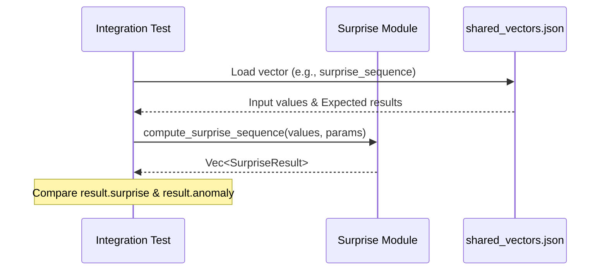

<details>
<summary>Relevant source files</summary>

The following files were used as context for generating this wiki page:

- [src/surprise.rs](src/surprise.rs)
- [tests/surprise_fixture_vectors.rs](tests/surprise_fixture_vectors.rs)
- [README.md](README.md)
- [src/lib.rs](src/lib.rs)
- [examples/demo.rs](examples/demo.rs)
- [tests/fixtures/shared_vectors.json](tests/fixtures/shared_vectors.json)

</details>

# Surprise Anomaly Detection

Surprise Anomaly Detection is a domain-agnostic signal-processing primitive designed to detect anomalous transitions within strictly positive stochastic signals. It operates by calculating a normalized log-ratio z-score, comparing observed transitions against an expected drift rate and volatility. This feature is optimized for real-time inference, with a typical execution time of approximately 100ns on modern hardware.

Sources: [src/surprise.rs:1-12](src/surprise.rs#L1-L12), [README.md:15](README.md#L15), [README.md:144](README.md#L144)

## Architecture and Logic

The module computes a "surprise" score for a transition between two consecutive positive samples. The core logic relies on the natural log-ratio of the current value to the previous value, which is then normalized into a z-score using user-defined parameters for drift (`mu`) and volatility (`sigma`) over a specific time step (`dt`).

### Mathematical Framework
The calculation involves three primary steps:
1.  **Log Return**: `ln(current_value / previous_value)`.
2.  **Expected Return**: `mu * dt`.
3.  **Standard Deviation Scale**: `sigma * sqrt(dt)`.

The surprise score itself is defined as the absolute value of the resulting z-score. If the input values are non-positive, the module returns a zeroed result to prevent undefined mathematical operations.

Sources: [src/surprise.rs:56-91](src/surprise.rs#L56-L91), [tests/fixtures/shared_vectors.json:239-251](tests/fixtures/shared_vectors.json#L239-L251)

### Data Flow
The following diagram illustrates the flow from raw signal input to anomaly classification.

```mermaid
flowchart TD
    In[Signal Input: Previous & Current] --> Validate{Is Positive?}
    Validate -- No --> Zero[Return Zeroed Result]
    Validate -- Yes --> Log[Calculate Log Return]
    Log --> ZScore[Compute Z-Score vs Expected Drift]
    ZScore --> Abs[Surprise = |Z-Score|]
    Abs --> Detect{Surprise > Threshold?}
    Detect -- Yes --> Anomaly[Flag Anomaly]
    Detect -- No --> Normal[Flag Normal]
```

The data flow ensures that every transition is evaluated relative to the statistical expectations defined in the parameters.
Sources: [src/surprise.rs:56-91](src/surprise.rs#L56-L91), [src/surprise.rs:118-122](src/surprise.rs#L118-L122)

## Key Components

### Data Structures
The module utilizes two primary structs to manage parameters and output results.

| Struct | Field | Type | Description |
| :--- | :--- | :--- | :--- |
| `SurpriseParams` | `mu` | `T` | Expected drift rate. |
| | `sigma` | `T` | Per-unit-time volatility. |
| | `dt` | `T` | Time step between samples. |
| | `threshold` | `T` | Absolute z-score threshold for anomalies. |
| `SurpriseResult` | `surprise` | `T` | Absolute z-score of the transition. |
| | `log_return` | `T` | Natural log-ratio (`ln(curr/prev)`). |
| | `expected_return` | `T` | The calculated `mu * dt`. |
| | `z_score` | `T` | Signed z-score. |

Sources: [src/surprise.rs:16-43](src/surprise.rs#L16-L43), [tests/surprise_fixture_vectors.rs:24-38](tests/surprise_fixture_vectors.rs#L24-L38)

### Principal Functions
The API provides three primary functions for different scales of analysis:

*  **`compute_surprise`**: Calculates the surprise result for a single transition between two values.
*  **`compute_surprise_sequence`**: Iterates through a slice of values, returning a vector of results for every consecutive pair. It returns an empty vector if the input has fewer than two elements.
*  **`detect_anomaly`**: A boolean helper that compares a `SurpriseResult` against the `threshold` defined in `SurpriseParams`.

Sources: [src/surprise.rs:56-59](src/surprise.rs#L56-L59), [src/surprise.rs:94-97](src/surprise.rs#L94-L97), [src/surprise.rs:118-122](src/surprise.rs#L118-L122)

## Implementation Example

The system supports generic numeric types (`f32` and `f64`). The following example demonstrates a standard sequence analysis.

```rust
use kinetic_signals::surprise::{SurpriseParams, compute_surprise_sequence, detect_anomaly};

let params = SurpriseParams {
    mu: 0.0,
    sigma: 0.15,
    dt: 0.001,
    threshold: 3.0,
};

// Sequence containing a calm step and a large spike
let series = vec![100.0, 100.5, 150.0];
let results = compute_surprise_sequence(&series, &params);

for r in results {
    if detect_anomaly(&r, &params) {
        println!("Anomaly detected! Z-score: {:.2}", r.z_score);
    }
}
```

Sources: [examples/demo.rs:125-171](examples/demo.rs#L125-L171), [src/lib.rs:88-91](src/lib.rs#L88-L91)

## Integration and Testing
The Rust implementation is verified against golden-vector fixtures located in `tests/fixtures/shared_vectors.json`. These fixtures ensure parity between the Rust crate and the `SpikeStream.jl` implementation. Tests cover normal transitions, spikes, drops, and zero-protection logic.



Sources: [tests/surprise_fixture_vectors.rs:85-115](tests/surprise_fixture_vectors.rs#L85-L115), [README.md:104-124](README.md#L104-L124), [tests/fixtures/shared_vectors.json:252-286](tests/fixtures/shared_vectors.json#L252-L286)
