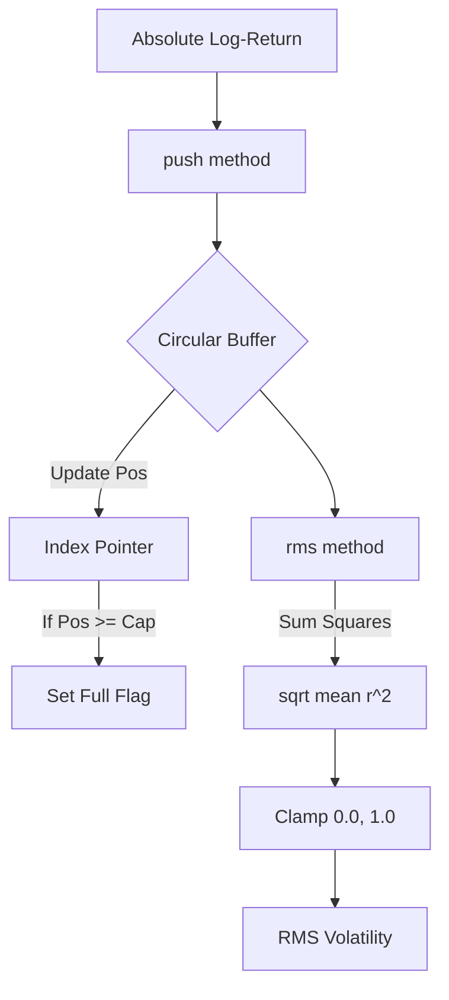

<details>
<summary>Relevant source files</summary>

The following files were used as context for generating this wiki page:

- [src/volatility.rs](src/volatility.rs)
- [README.md](README.md)
- [src/lib.rs](src/lib.rs)
- [examples/demo.rs](examples/demo.rs)
- [tests/cross_language_ranges.rs](tests/cross_language_ranges.rs)
- [tests/fixtures/shared_vectors.json](tests/fixtures/shared_vectors.json)
</details>

# Rolling Volatility (RMS)

The Rolling Volatility (RMS) module in the `kinetic-signals` crate provides a high-performance, zero-allocation estimator for tracking the volatility of stochastic signals over a fixed-size window. It specifically implements a Root Mean Square (RMS) calculation based on absolute log-returns, designed for real-time inference on high-velocity data streams.

Sources: [README.md:16](README.md#L16), [src/volatility.rs:3](src/volatility.rs#L3), [src/lib.rs:5-8](src/lib.rs#L5-L8)

## Architecture and Design

The core of the volatility tracking system is the `VolEstimator` struct, which utilizes a circular (ring) buffer to store signal inputs. This design ensures that memory usage remains constant ($O(\text{capacity})$) regardless of how many samples are processed. The implementation is domain-agnostic and prioritizes performance, making it suitable for applications ranging from sensor magnitude analysis to financial signal processing.

Sources: [src/volatility.rs:3-5](src/volatility.rs#L3-L5), [README.md:154-159](README.md#L154-L159), [src/lib.rs:11-13](src/lib.rs#L11-L13)

### Data Flow

The following diagram illustrates how data enters the `VolEstimator`, is stored within the circular buffer, and is processed to produce a volatility metric.



The logic ensures that if the buffer is not yet full, calculations only consider the indices that have been populated.

Sources: [src/volatility.rs:35-58](src/volatility.rs#L35-L58)

## Key Components

### VolEstimator Struct

The `VolEstimator` is the primary data structure for rolling volatility. It is implemented with `f32` precision for absolute log-returns to optimize for performance in real-time update loops.

| Field | Type | Description |
| :--- | :--- | :--- |
| `buf` | `Vec<f32>` | The underlying vector used as a circular buffer. |
| `pos` | `usize` | Current insertion index. |
| `full` | `bool` | Flag indicating if the buffer has been completely filled at least once. |
| `cap` | `usize` | Total window size (capacity). |

Sources: [src/volatility.rs:18-23](src/volatility.rs#L18-L23)

### API Methods

The `VolEstimator` provides a concise API for streaming updates and retrieval of the RMS metric.

| Method | Signature | Description |
| :--- | :--- | :--- |
| `new` | `fn new(capacity: usize) -> Self` | Initializes a new estimator. Panics if capacity is 0. |
| `push` | `fn push(&mut self, val: f32)` | Inserts a new value and advances the internal position. |
| `rms` | `fn rms(&self) -> f32` | Computes the current RMS volatility: $\sqrt{\text{mean}(r^2)}$. |
| `len` | `fn len(&self) -> usize` | Returns the current number of valid samples in the buffer. |

Sources: [src/volatility.rs:26-64](src/volatility.rs#L26-L64)

## Mathematical Implementation

The volatility is calculated as the Root Mean Square of the stored absolute log-returns ($r$). The implementation performs the following steps during the `rms()` call:
1. Determines the active sample count ($n$): if the buffer is full, $n = \text{capacity}$; otherwise, $n = \text{insertion\_position}$.
2. Calculates the sum of squares: $\sum_{i=1}^{n} r_i^2$.
3. Computes the final value: $\sqrt{\frac{\sum r_i^2}{n}}$.
4. Clamps the result to the range $[0, 1]$.

Sources: [src/volatility.rs:46-58](src/volatility.rs#L46-L58), [tests/fixtures/shared_vectors.json:521-524](tests/fixtures/shared_vectors.json#L521-L524)

## Parity and Testing

The implementation is verified against shared golden fixtures to ensure consistency with the `SpikeStream.jl` ecosystem.

```rust
#[test]
fn volatility_rms_nonnegative() {
    let mut est = VolEstimator::new(window);
    for x in returns {
        est.push(x as f32);
    }
    let rms = est.rms();
    assert!(rms.is_finite());
}
```

Sources: [tests/cross_language_ranges.rs:107-115](tests/cross_language_ranges.rs#L107-L115), [tests/fixtures/shared_vectors.json:506-525](tests/fixtures/shared_vectors.json#L506-L525)

### Output Range Convention
Consistent with the crate's cross-language standards, the volatility feature adheres to specific output constraints.

| Feature | Output | Range | Note |
| :--- | :--- | :--- | :--- |
| Volatility | `rms` | `[0, 1]` | Clamped to unit interval |

Sources: [README.md:143](README.md#L143), [tests/fixtures/shared_vectors.json:521-524](tests/fixtures/shared_vectors.json#L521-L524)

## Conclusion

Rolling Volatility (RMS) via `VolEstimator` provides a lightweight, O(1) update mechanism for monitoring signal power and variability. By utilizing a fixed-size ring buffer and zero-allocation updates, it serves as a foundational primitive for anomaly detection and signal characterization in high-velocity streaming environments.

Sources: [src/volatility.rs:1-5](src/volatility.rs#L1-L5), [README.md:154-159](README.md#L154-L159)
