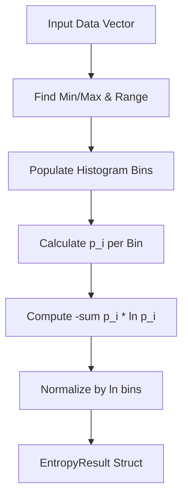

<details>
<summary>Relevant source files</summary>

The following files were used as context for generating this wiki page:

- [src/entropy.rs](src/entropy.rs)
- [README.md](README.md)
- [src/lib.rs](src/lib.rs)
- [examples/demo.rs](examples/demo.rs)
- [tests/fixtures/shared_vectors.json](tests/fixtures/shared_vectors.json)
- [tests/cross_language_ranges.rs](tests/cross_language_ranges.rs)
</details>

# Shannon Entropy Measurement

Shannon entropy measurement in the `kinetic-signals` crate provides a way to quantify the average information content, complexity, or disorder of a real-valued signal. Within the context of this project, entropy is computed via histogram discretization, where a signal is partitioned into equal-width bins to estimate the underlying probability distribution.

Sources: [src/entropy.rs:3-10](src/entropy.rs#L3-L10), [README.md:16-16](README.md#L16)

The system is designed for high-performance extraction of features from stochastic time-series. The entropy measurement helps distinguish between highly deterministic signals (values near zero entropy) and near-uniform, complex distributions (values near \(\ln(\text{bins})\)). This metric is part of a broader suite of indicators, including the [Hurst Exponent](#hurst-exponent) and [Hawkes Process](#hawkes-process) intensity, used for signal analysis.

Sources: [src/lib.rs:16-16](src/lib.rs#L16), [src/entropy.rs:6-9](src/entropy.rs#L6-L9)

## Mathematical Implementation

The module implements natural-log Shannon entropy, calculated as \( -\sum p_i \ln p_i \), where \( p_i \) is the probability of a sample falling into a specific bin. It also provides a relative (normalized) form within the range \([0, 1]\).

Sources: [src/entropy.rs:16-20](src/entropy.rs#L16-L20), [README.md:124-124](README.md#L124)

### Data Flow for Entropy Calculation

The following diagram illustrates the transformation of raw signal data into entropy metrics through the discretization process.



The calculation requires identifying the global min and max of the input slice to establish the histogram range. If the range is zero (constant series), the entropy is immediately returned as zero.

Sources: [src/entropy.rs:48-63](src/entropy.rs#L48-L63)

## Key Components and APIs

### Data Structures
The primary return type for entropy operations is the `EntropyResult` struct, which encapsulates the absolute entropy, the normalized version, and the count of active bins.

| Field | Type | Description |
| :--- | :--- | :--- |
| `shannon` | `f64` | Shannon entropy in nats. |
| `relative` | `f64` | Entropy normalized by \(\ln(\text{bins})\), range \([0, 1]\). |
| `bin_count` | `usize` | Number of histogram bins that received at least one sample. |

Sources: [src/entropy.rs:13-21](src/entropy.rs#L13-L21)

### Core Function: `compute_shannon_entropy`
This function is the main entry point for entropy measurement. It takes a slice of `f64` data and the desired number of bins for discretization.

```rust
pub fn compute_shannon_entropy(data: &[f64], bins: usize) -> EntropyResult
```

Sources: [src/entropy.rs:37-37](src/entropy.rs#L37), [src/lib.rs:64-64](src/lib.rs#L64)

### Logic Constraints and Edge Cases
- **Insufficient Data**: If the input data has fewer than two samples or the requested bins are zero, the function returns a zeroed result.
- **Constant Signals**: A series with zero range yields a `shannon` entropy of `0.0` and a `bin_count` of `1`.
- **Normalization**: The relative entropy is calculated by dividing the Shannon entropy by \(\ln(\text{bins})\). If the maximum possible entropy is zero (e.g., 1 bin), relative entropy defaults to `0.0`.

Sources: [src/entropy.rs:38-46](src/entropy.rs#L38-L46), [src/entropy.rs:79-84](src/entropy.rs#L79-L84)

## Integration and Usage

### Cross-Language Parity
The entropy implementation is aligned with the `SpikeStream.jl` implementation. Parity is maintained using shared golden fixtures that define expected output ranges.

| Metric | Range |
| :--- | :--- |
| Shannon | `[0, ln(bins)]` |
| Relative | `[0, 1]` |

Sources: [README.md:124-124](README.md#L124), [tests/fixtures/shared_vectors.json:417-424](tests/fixtures/shared_vectors.json#L417-L424)

### Example Usage
The implementation is demonstrated in the `demo.rs` example, showing the difference between low-complexity (deterministic) and high-complexity (random) signals.

```rust
// Low complexity example
let low_entropy = vec![1.0, 1.0, 1.1, 1.0, 0.9, 1.0];
let res1 = compute_shannon_entropy(&low_entropy, 10);

// High complexity example
let high_entropy: Vec<f64> = (0..100).map(|_| pseudo_random_f64(&mut rng)).collect();
let res2 = compute_shannon_entropy(&high_entropy, 10);
```

Sources: [examples/demo.rs:189-204](examples/demo.rs#L189-L204)

## Technical Summary
Shannon Entropy Measurement serves as a critical indicator of signal complexity within the `kinetic-signals` ecosystem. By utilizing histogram discretization, it provides a robust, domain-agnostic metric for assessing the information density of stochastic time-series, while maintaining thread-safety (`Send + Sync`) and high performance.

Sources: [src/lib.rs:94-94](src/lib.rs#L94), [src/entropy.rs:3-10](src/entropy.rs#L3-L10)
