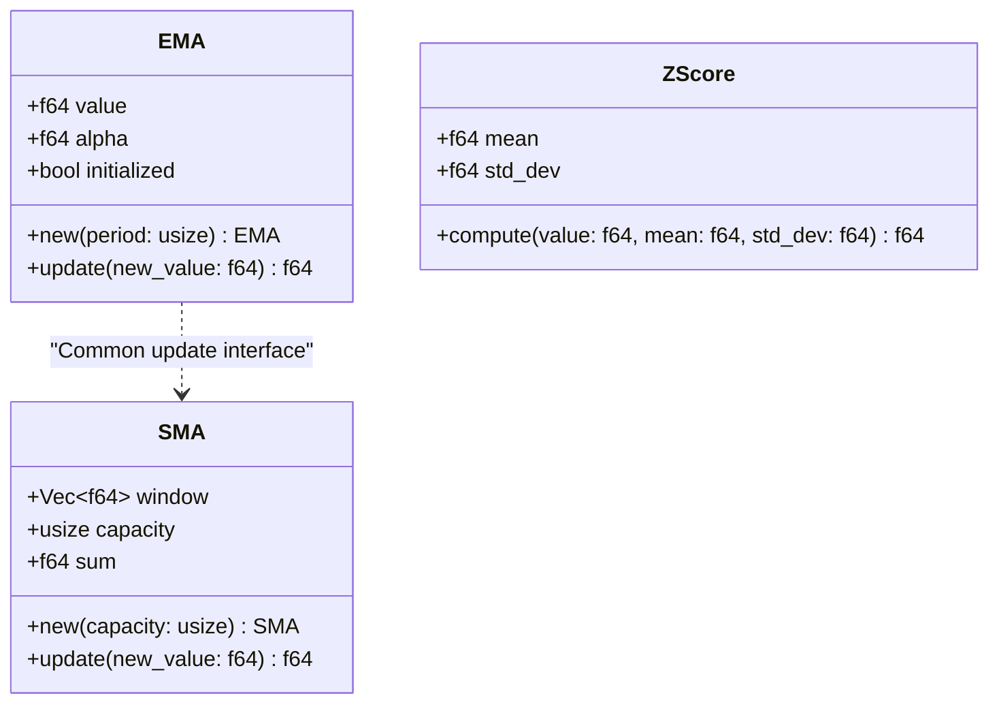
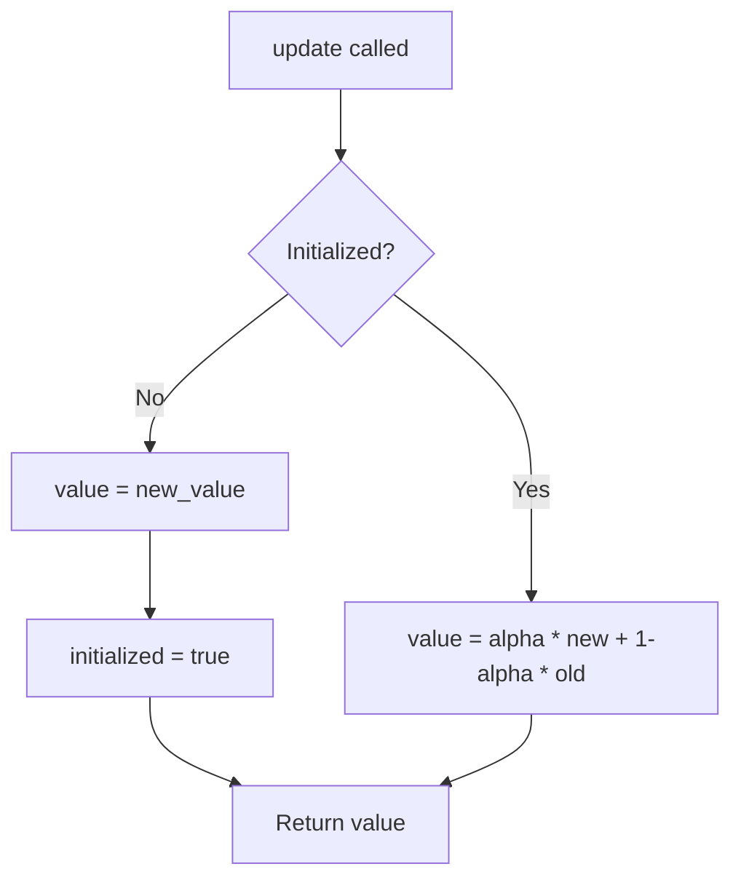

<details>
<summary>Relevant source files</summary>

The following files were used as context for generating this wiki page:

- [src/indicators.rs](src/indicators.rs)
- [README.md](README.md)
- [src/lib.rs](src/lib.rs)
- [examples/demo.rs](examples/demo.rs)
- [src/stats.rs](src/stats.rs)
- [AGENTS.md](AGENTS.md)
</details>

# Indicators (SMA, EMA, Z-Score)

The `kinetic-signals` crate provides a suite of streaming technical indicators designed for real-valued signals. These components are architected as lightweight, allocation-conscious estimators optimized for high-velocity update loops where real-time inference is critical.

These indicators allow for the tracking of moving averages and signal normalization (Z-Score) without requiring a full history of the data in memory, except for the fixed-window requirements of the Simple Moving Average. They are part of a broader ecosystem for stochastic signal feature extraction, complementing other modules like [Hawkes Process](#hawkes) and [Surprise Detection](#surprise).

Sources: [src/indicators.rs:1-8](src/indicators.rs#L1-L8), [src/lib.rs:20-22](src/lib.rs#L20-L22), [README.md:144-149](README.md#L144-L149)

## Core Data Structures

The indicators are implemented as individual structs that maintain their own internal state to support streaming updates.

### Indicator Architecture



The diagram above illustrates the structural representation of the three primary indicator types.
Sources: [src/indicators.rs:24-118](src/indicators.rs#L24-L118)

## Exponential Moving Average (EMA)

The EMA provides a weighted moving average that places more significance on recent data points. It uses a smoothing factor $\alpha$ calculated as $2 / (period + 1)$.

### Logic and Data Flow
1. **Initialization**: The first call to `update` seeds the internal `value` with the first observed sample.
2. **Streaming**: Subsequent updates blend the new sample with the existing value using the formula:
  $Value_{new} = \alpha \cdot NewValue + (1 - \alpha) \cdot Value_{old}$



This flow ensures the EMA does not require a "warm-up" period of $N$ samples before returning a value.
Sources: [src/indicators.rs:24-54](src/indicators.rs#L24-L54)

## Simple Moving Average (SMA)

The SMA calculates the arithmetic mean of a signal over a fixed-capacity window. It is implemented using a `Vec<f64>` as a sliding window.

### Logic and Data Flow
1. **Window Management**: The SMA retains at most `capacity` samples. 
2. **Memory Efficiency**: When the window reaches capacity, the oldest sample is removed from the beginning of the vector before the new sample is pushed.
3. **Running Sum**: It maintains a running `sum` to ensure the mean calculation is $O(1)$ regarding the window size during updates (though `Vec::remove(0)` remains $O(N)$).

| Field | Type | Description |
| :--- | :--- | :--- |
| `window` | `Vec<f64>` | Stores the samples currently in the window (oldest first). |
| `capacity` | `usize` | The maximum number of samples to retain. |
| `sum` | `f64` | The running sum of all samples currently in the window. |

Sources: [src/indicators.rs:85-118](src/indicators.rs#L85-L118)

## Z-Score Normalization

The `ZScore` module facilitates standard-score normalization, allowing signals to be expressed in terms of standard deviations from a reference mean.

### Operational Modes
- **Static Computation**: The primary entry point is the static `compute` method, which calculates $(value - mean) / std\_dev$.
- **Protection**: The implementation includes a safety check to return `0.0` if the standard deviation is near zero ($< 1e-12$) to prevent division-by-zero errors.
- **Integration**: In practice, `ZScore` is often used in conjunction with `SignalStats` to normalize incoming prices or signals against the properties of a larger dataset.

```rust
// Example of Z-Score usage with SignalStats
let stats = compute_signal_stats(&prices);
let std = stats.variance.sqrt();
for &p in &prices {
    let z = ZScore::compute(p, stats.mean, std);
}
```

Sources: [src/indicators.rs:59-80](src/indicators.rs#L59-L80), [examples/demo.rs:223-233](examples/demo.rs#L223-L233), [src/stats.rs:77-80](src/stats.rs#L77-L80)

## Implementation Details

The indicators are exposed through the library's prelude and follow the project's zero-dependency requirement.

| Indicator | Implementation | Complexity | Memory |
| :--- | :--- | :--- | :--- |
| **EMA** | Alpha-based blending | $O(1)$ | $O(1)$ |
| **SMA** | Fixed-window vector | $O(N)$ on remove | $O(capacity)$ |
| **Z-Score** | Static normalization | $O(1)$ | $O(1)$ (Stateless) |

Sources: [src/lib.rs:71](src/lib.rs#L71), [AGENTS.md:31-35](AGENTS.md#L31-L35), [src/indicators.rs:10-14](src/indicators.rs#L10-L14)

## Summary

Indicators in the `kinetic-signals` project provide essential primitives for real-time signal processing. By implementing EMA and SMA as streaming-capable structs, the system avoids the need for re-calculating averages from full histories. The Z-Score helper rounds out the module by providing safe, normalized comparisons, essential for anomaly detection and relative signal strength analysis.

Sources: [README.md:144-150](README.md#L144-L150), [src/indicators.rs:1-8](src/indicators.rs#L1-L8)
