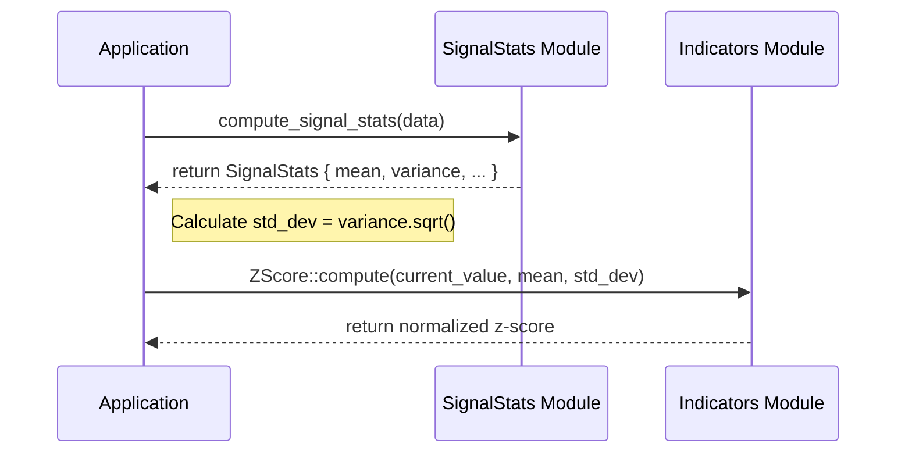

<details>
<summary>Relevant source files</summary>

The following files were used as context for generating this wiki page:

- [src/stats.rs](src/stats.rs)
- [tests/stats_fixture_vectors.rs](tests/stats_fixture_vectors.rs)
- [README.md](README.md)
- [src/lib.rs](src/lib.rs)
- [examples/demo.rs](examples/demo.rs)
- [tests/fixtures/shared_vectors.json](tests/fixtures/shared_vectors.json)
- [src/indicators.rs](src/indicators.rs)
</details>

# Signal Statistics (Moments)

The Signal Statistics module in the `kinetic-signals` crate provides high-performance, domain-agnostic tools for extracting central moments and shape descriptors from real-valued stochastic signals. Its primary purpose is to compute high-order statistics—including mean, variance, skewness, and excess kurtosis—to characterize the distribution and behavior of time-series data.

This module is designed for batch feature extraction where a sample slice is available. While the project provides streaming estimators like `VolEstimator` for real-time volatility, the `stats` module focuses on comprehensive distributional analysis through a two-pass algorithm that ensures numerical stability by first computing the arithmetic mean before calculating higher-order moments.

Sources: [src/stats.rs:1-8](src/stats.rs#L1-L8), [src/lib.rs:5-15](src/lib.rs#L5-L15), [README.md:144-150](README.md#L144-L150)

## Core Data Structures

The module's primary output is encapsulated in the `SignalStats` structure, which stores the calculated moments of a signal sample.

| Field | Type | Description |
| :--- | :--- | :--- |
| `mean` | `f64` | The arithmetic mean of the signal. |
| `variance` | `f64` | Population variance ($m_2 / n$), not Bessel-corrected. |
| `skewness` | `f64` | Sample skewness ($m_3 / \sigma^3$); measures distribution asymmetry. |
| `kurtosis` | `f64` | Excess kurtosis ($m_4 / \sigma^4 - 3$); measures "tailedness" relative to a Gaussian distribution. |
| `count` | `usize` | The total number of samples processed. |

Sources: [src/stats.rs:11-23](src/stats.rs#L11-L23), [tests/fixtures/shared_vectors.json:420-435](tests/fixtures/shared_vectors.json#L420-L435)

## Statistical Computation Logic

The computation is performed via `compute_signal_stats`, which utilizes a two-pass approach over a slice of `f64` data. The first pass calculates the sum to derive the mean, while the second pass iterates through the data to compute the second ($m_2$), third ($m_3$), and fourth ($m_4$) central moments.

### Algorithmic Flow

The following diagram illustrates the internal logic of the `compute_signal_stats` function:

```mermaid
flowchart TD
    Start([Input: &[f64]]) --> CheckEmpty{Length == 0?}
    CheckEmpty -- Yes --> ZeroRes[Return all-zero SignalStats]
    CheckEmpty -- No --> Pass1[Pass 1: Sum elements / Count]
    Pass1 --> CalcMean[Compute Arithmetic Mean]
    CalcMean --> Pass2[Pass 2: Iterate and compute diffs]
    Pass2 --> Moments[Accumulate m2, m3, m4]
    Moments --> FinalStats[Calculate Variance, Skew, Kurtosis]
    FinalStats --> End([Output: SignalStats])
```

The implementation includes safeguards against division by zero; if the variance or standard deviation is near zero (specifically `< 1e-12`), skewness and kurtosis are defaulted to `0.0`.

Sources: [src/stats.rs:43-85](src/stats.rs#L43-L85), [tests/stats_fixture_vectors.rs:77-83](tests/stats_fixture_vectors.rs#L77-L83)

### Mathematical Implementation
The moments are computed as population moments (dividing by $n$):
- **Variance**: $\sigma^2 = m_2 / n$
- **Skewness**: $Skew = (m_3 / n) / \sigma^3$
- **Excess Kurtosis**: $Kurt = (m_4 / n) / \sigma^4 - 3$

Sources: [src/stats.rs:70-80](src/stats.rs#L70-L80), [tests/fixtures/shared_vectors.json:435-440](tests/fixtures/shared_vectors.json#L435-L440)

## Integration and Usage

The module is exposed via the crate root and the `prelude` module for ease of use. It is often used alongside technical indicators like `EMA`, `SMA`, and `ZScore` to provide a baseline for signal normalization.

```rust
use kinetic_signals::compute_signal_stats;

let data = vec![1.0, 2.0, 3.0, 4.0, 5.0];
let stats = compute_signal_stats(&data);
// Result: mean=3.0, variance=2.0, skewness=0.0, kurtosis=-1.3
```

Sources: [src/lib.rs:71-85](src/lib.rs#L71-L85), [examples/demo.rs:218-225](examples/demo.rs#L218-L225), [src/stats.rs:32-40](src/stats.rs#L32-L40)

### Relationship with Indicators
`SignalStats` provides the global parameters (mean and standard deviation) required by normalization helpers like `ZScore`.



Sources: [examples/demo.rs:242-255](examples/demo.rs#L242-L255), [src/indicators.rs:65-75](src/indicators.rs#L65-L75)

## Testing and Parity

The statistical outputs are verified against "golden" test vectors shared with `SpikeStream.jl` to ensure cross-language parity. This ensures that features like Skewness and Kurtosis remain deterministic across different implementations in the ecosystem.

| Vector Key | Input Type | Expected Characteristics |
| :--- | :--- | :--- |
| `signal_stats` | Symmetric [1..5] | Mean=3.0, Skewness=0.0, Kurtosis=-1.3 |
| `signal_stats_skewed` | Right-skewed data | Skewness > 0, Kurtosis > 0 |

Sources: [tests/fixtures/shared_vectors.json:420-466](tests/fixtures/shared_vectors.json#L420-L466), [tests/stats_fixture_vectors.rs:1-35](tests/stats_fixture_vectors.rs#L1-L35)

## Conclusion

The Signal Statistics module serves as a foundational component for characterizing time-series distributions within the `kinetic-signals` crate. By providing robust, two-pass calculations for higher-order moments, it enables developers to detect distribution asymmetries (skewness) and extreme event probabilities (kurtosis) in high-velocity signals. This data is critical for subsequent normalization and anomaly detection tasks across the Limen-Neural ecosystem.

Sources: [src/lib.rs:5-15](src/lib.rs#L5-L15), [README.md:144-150](README.md#L144-L150)
