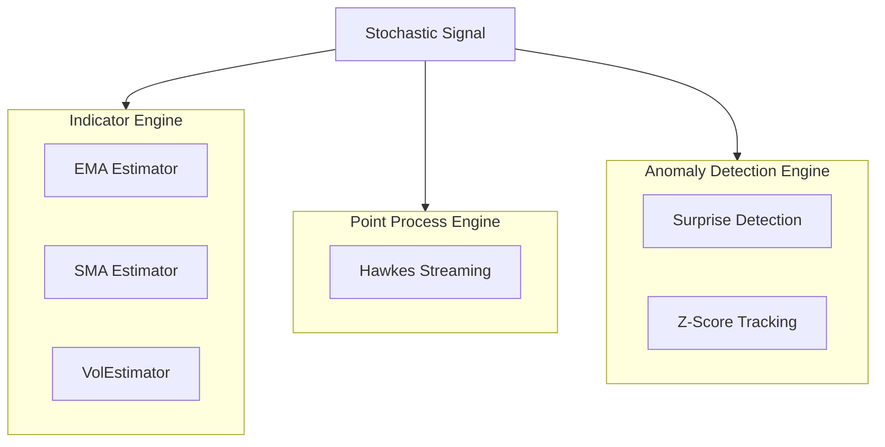
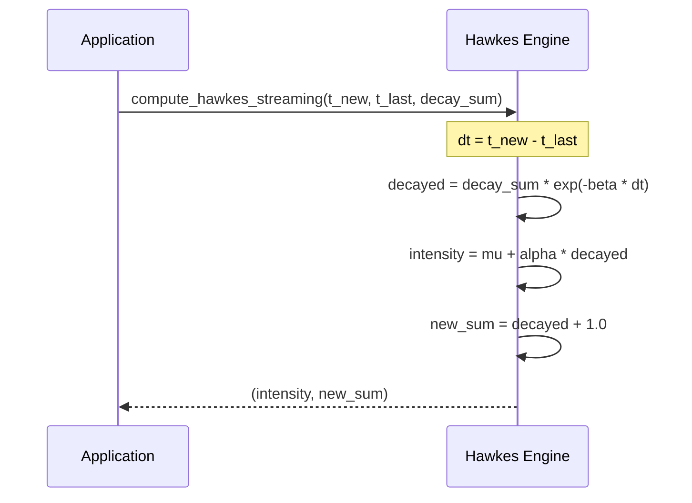
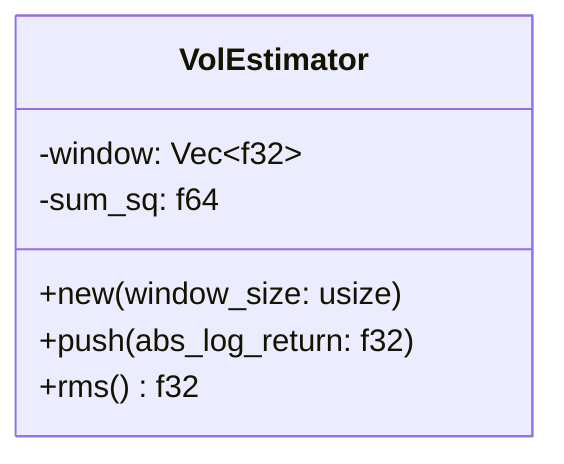

<details>
<summary>Relevant source files</summary>

The following files were used as context for generating this wiki page:

- [src/lib.rs](src/lib.rs)
- [src/indicators.rs](src/indicators.rs)
- [src/hawkes.rs](src/hawkes.rs)
- [src/surprise.rs](src/surprise.rs)
- [src/volatility.rs](src/volatility.rs)
- [README.md](README.md)
</details>

# Streaming Processing Engine

The Streaming Processing Engine within the `kinetic-signals` crate is a high-performance, domain-agnostic system designed for extracting features from high-velocity stochastic signals. It facilitates real-time computation of signal statistics, long-memory estimates, point-process intensity, and anomaly detection metrics without assuming a specific application domain.

The engine is built with aggressive optimizations for real-time inference, achieving sub-microsecond latency for operations like surprise detection and approximately 5μs for Hawkes process updates on modern hardware. It adheres to a zero-required-runtime-dependency philosophy, ensuring lightweight integration into larger ecosystems.

Sources: [src/lib.rs:3-14](src/lib.rs#L3-L14), [README.md:5-15](README.md#L5-L15), [README.md:121-125](README.md#L121-L125)

## Architecture and Core Components

The engine's architecture is modular, consisting of several specialized estimators and functions that process data either in batch sequences or via O(1) online updates.



The diagram above illustrates the high-level data flow from a raw stochastic signal into the three primary functional engines of the crate.

Sources: [src/lib.rs:39-50](src/lib.rs#L39-L50), [src/indicators.rs:7-12](src/indicators.rs#L7-L12)

### Technical Indicators
The engine provides allocation-conscious estimators for real-valued signals. These are designed for high-velocity update loops where state must be maintained across individual samples.

| Component | Logic | Complexity |
| :--- | :--- | :--- |
| **EMA** | Exponential moving average using $\alpha = 2 / (period + 1)$ | O(1) |
| **SMA** | Simple moving average over a fixed-capacity ring buffer | O(1) |
| **ZScore** | Normalization using $(value - mean) / std\_dev$ | O(1) |

Sources: [src/indicators.rs:18-24](src/indicators.rs#L18-L24), [src/indicators.rs:56-62](src/indicators.rs#L56-L62), [src/indicators.rs:75-81](src/indicators.rs#L75-L81)

## Point-Process Intensity (Hawkes)

The engine implements Hawkes self-exciting point process models to track event clusters. It supports both batch estimation over full histories and O(1) online updates for real-time streams.

### Streaming Intensity Logic
The streaming Hawkes implementation maintains a running "decayed event-count sum". When a new event arrives, the engine calculates the time delta since the last event, decays the existing sum exponentially, and calculates the new intensity.



The sequence diagram shows the O(1) update logic used to maintain intensity state as new events arrive.

Sources: [src/hawkes.rs:104-126](src/hawkes.rs#L104-L126)

## Anomaly Detection (Surprise)

The engine detects "surprise" transitions between consecutive samples. This is defined as the absolute z-score of the observed log-ratio relative to an expected drift, scaled by per-step volatility.

### Surprise Parameters and Calculation
The detection logic utilizes a set of parameters to define the "normal" behavior of the signal. If a transition results in a surprise score exceeding a configured threshold, it is flagged as an anomaly.

| Parameter | Type | Description |
| :--- | :--- | :--- |
| `mu` | Generic | Expected drift rate of the signal |
| `sigma` | Generic | Per-unit-time volatility |
| `dt` | Generic | Time step between samples |
| `threshold` | Generic | Z-score limit for anomaly flagging |

Sources: [src/surprise.rs:33-42](src/surprise.rs#L33-L42), [src/surprise.rs:94-98](src/surprise.rs#L94-L98)

```rust
// Surprise calculation logic
let log_return = (current_value / previous_value).ln();
let expected_return = params.mu * params.dt;
let std_dev = params.sigma * params.dt.sqrt();
let z_score = (log_return - expected_return) / std_dev;
let surprise = z_score.abs();
```

Sources: [src/surprise.rs:69-82](src/surprise.rs#L69-L82)

## Volatility Estimation

For real-time variance and standard deviation tracking, the engine uses the `VolEstimator`. This component consumes absolute log-returns and computes a rolling Root Mean Square (RMS) volatility.

### VolEstimator Structure
The `VolEstimator` uses a fixed-size window to maintain memory efficiency while providing a continuous estimate of signal power.



The class diagram represents the structure for tracking rolling volatility.

Sources: [src/lib.rs:52](src/lib.rs#L52), [README.md:104-106](README.md#L104-L106), [examples/demo.rs:188-195](examples/demo.rs#L188-L195)

## Summary

The Streaming Processing Engine is designed for low-latency, high-throughput signal analysis. By providing O(1) updates for indicators (EMA, SMA), point processes (Hawkes), and volatility (VolEstimator), it allows applications to process stochastic time-series data with minimal overhead. Its domain-agnostic nature makes it suitable for diverse fields ranging from sensor monitoring to financial data analysis.

Sources: [src/lib.rs:5-12](src/lib.rs#L5-L12), [README.md:118-125](README.md#L118-L125)
