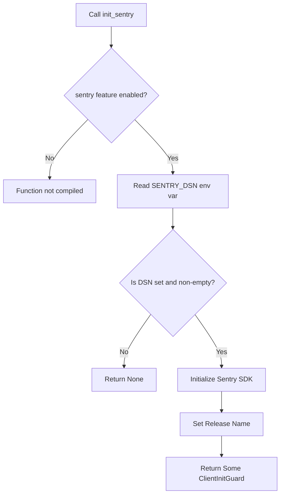
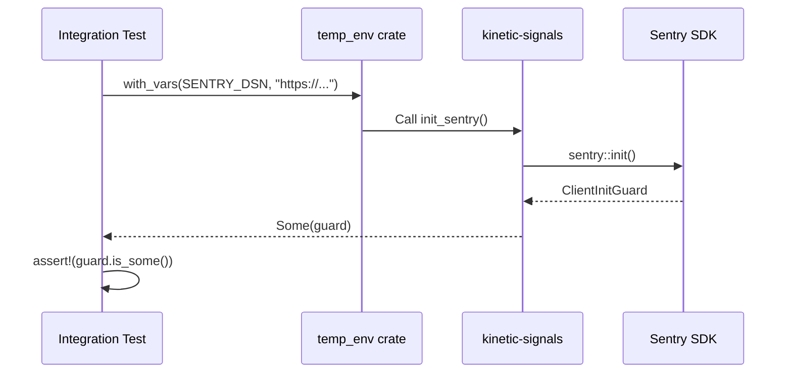

<details>
<summary>Relevant source files</summary>

The following files were used as context for generating this wiki page:

- [Cargo.toml](Cargo.toml)
- [README.md](README.md)
- [src/lib.rs](src/lib.rs)
- [tests/sentry_feature.rs](tests/sentry_feature.rs)
- [AGENTS.md](AGENTS.md)
- [examples/demo.rs](examples/demo.rs)

</details>

# Sentry Telemetry Setup

Sentry Telemetry Setup provides optional error monitoring and observability for the `kinetic-signals` crate. This integration allows the library to capture and report errors or events to the Sentry service, specifically designed for high-velocity signal processing environments.

The feature is implemented as an opt-in capability, ensuring that the library remains "zero-dependency" by default. It is gated behind the `sentry` feature flag and requires the presence of a Data Source Name (DSN) to activate at runtime.

Sources: [README.md:214-235](README.md#L214-L235), [AGENTS.md:21-25](AGENTS.md#L21-L25)

## Configuration and Feature Gating

The Sentry integration is managed through Rust's feature flag system and environment variables. To utilize this functionality, the crate must be compiled with the `sentry` feature enabled.

| Component | Type | Requirement | Description |
|-----------|------|-------------|-------------|
| `sentry` | Feature Flag | Optional | Enables Sentry SDK dependency and `init_sentry()` function. |
| `SENTRY_DSN` | Env Var | Required at runtime | The endpoint URL provided by Sentry for event ingestion. |
| `sentry` crate | Dependency | Version 0.48.2 | The underlying SDK used for reporting. |

Sources: [Cargo.toml:14,21](Cargo.toml#L14), [AGENTS.md:21-25](AGENTS.md#L21-L25), [src/lib.rs:37-41](src/lib.rs#L37-L41)

### Feature Flag Implementation
In `Cargo.toml`, the Sentry dependency is marked as optional. Enabling the `sentry` feature pulls in the `sentry` crate dependency.

```toml
[dependencies]
sentry = { version = "0.48.2", optional = true }

[features]
default = []
sentry = ["dep:sentry"]
```

Sources: [Cargo.toml:14,20-21](Cargo.toml#L14)

## Initialization Logic

The primary entry point for telemetry is the `init_sentry()` function. This function attempts to read the `SENTRY_DSN` environment variable. If the variable is present and not empty, it initializes the Sentry client with specific release information.

### Logic Flow

The following diagram illustrates the initialization process:



The initialization automatically sets the release name using the format `CARGO_PKG_NAME@CARGO_PKG_VERSION` (e.g., `kinetic-signals@0.4.0`).

Sources: [src/lib.rs:42-60](src/lib.rs#L42-L60), [README.md:231-233](README.md#L231-L233)

### The Client Guard
When successfully initialized, the function returns a `sentry::ClientInitGuard`. This guard must be kept alive for the duration of the program. When the guard is dropped, Sentry flushes pending events, allowing up to 2 seconds for transmission.

Sources: [src/lib.rs:44-46](src/lib.rs#L44-L46), [README.md:224-227](README.md#L224-L227)

## Usage and Implementation

Developers can integrate Sentry by calling the initialization function early in the application lifecycle, typically in the `main` function.

### Example Integration

```rust
fn main() {
    #[cfg(feature = "sentry")]
    let _guard = kinetic_signals::init_sentry();

    // Application logic continues...
}
```

Sources: [examples/demo.rs:24-26](examples/demo.rs#L24-L26), [README.md:227](README.md#L227)

### Release Management
The project includes a dedicated CI workflow (`sentry-release.yml`) that creates Sentry releases whenever a tag matching `v*` is pushed to the repository. This aligns the telemetry data with specific library versions.

Sources: [AGENTS.md:52](AGENTS.md#L52), [README.md:231-233](README.md#L231-L233)

## Testing and Verification

The Sentry feature is verified through integration tests that simulate environment variable configurations.



Testing requires the `temp-env` and `serial_test` dev-dependencies to safely manipulate environment variables without affecting other tests running in parallel.

Sources: [tests/sentry_feature.rs:11-30](tests/sentry_feature.rs#L11-L30), [AGENTS.md:26-28](AGENTS.md#L26-L28)

## Conclusion
The Sentry Telemetry Setup in `kinetic-signals` provides a robust but non-intrusive monitoring solution. By utilizing feature gating and environment-based activation, it ensures that users only incur the dependency and runtime overhead when explicitly required for production observability.
