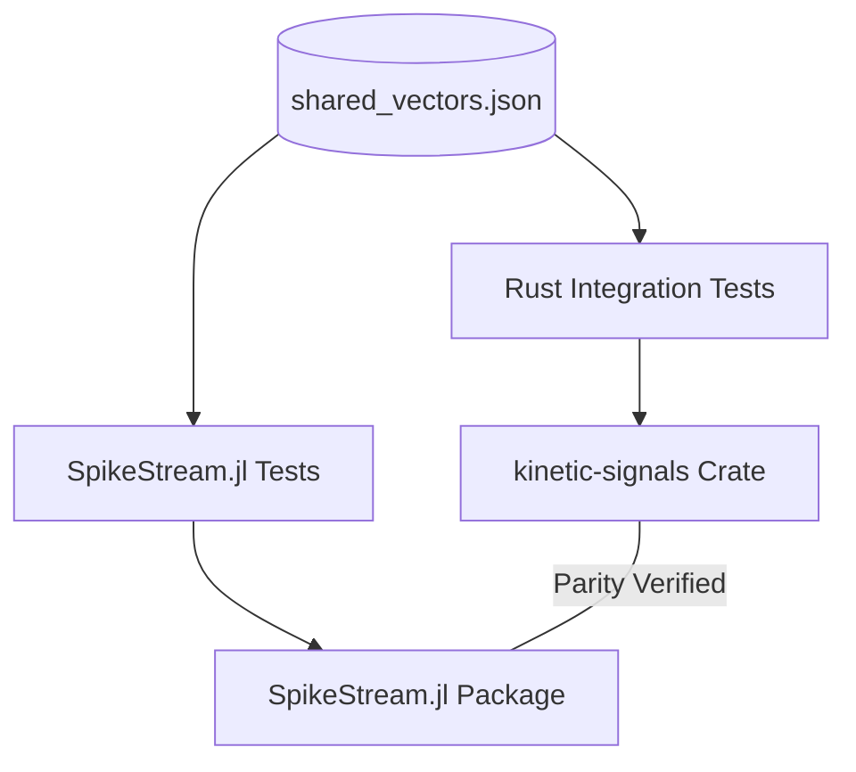
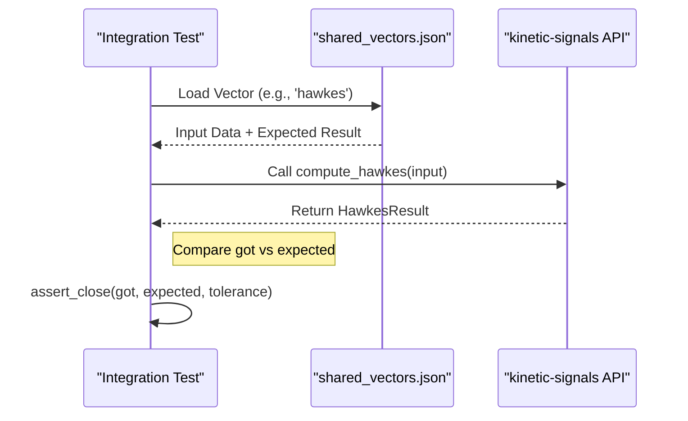

Relevant source files

The following files were used as context for generating this wiki page:

- [README.md](README.md)
- [AGENTS.md](AGENTS.md)
- [tests/fixtures/shared_vectors.json](tests/fixtures/shared_vectors.json)
- [tests/cross_language_ranges.rs](tests/cross_language_ranges.rs)
- [REVIEW.md](REVIEW.md)
- [tests/hawkes_fixture_vectors.rs](tests/hawkes_fixture_vectors.rs)
- [tests/surprise_fixture_vectors.rs](tests/surprise_fixture_vectors.rs)

# SpikeStream.jl Alignment

SpikeStream.jl Alignment refers to the synchronization and parity maintenance between the Rust `kinetic-signals` crate and the Julia `SpikeStream.jl` project. This alignment ensures that experimental results, feature extraction logic, and output ranges remain consistent across both implementations within the Limen-Neural ecosystem. Sources: [README.md:144-148](README.md#L144-L148), [AGENTS.md:7-9](AGENTS.md#L7-L9)

The primary mechanism for this alignment is a shared set of "golden" test vectors that define expected inputs and outputs for core signal processing algorithms. This shared state allows both projects to validate their implementations against a common truth, facilitating cross-repo handoffs where `kinetic-signals` handles domain-agnostic feature extraction and `SpikeStream.jl` focuses on spike-train analysis. Sources: [README.md:162-171](README.md#L162-L171), [REVIEW.md:95-97](REVIEW.md#L95-L97)

## Shared Validation Framework

The alignment is enforced through integration tests that consume a standardized JSON fixture file. This ensures that any change in the mathematical implementation in one language is immediately detectable as a regression or discrepancy in the other.

### Shared Fixture Structure
The file `tests/fixtures/shared_vectors.json` serves as the single source of truth for both projects. It contains input data, parameters, expected results, and allowed numerical tolerances (typically $1e-6$). Sources: [tests/fixtures/shared_vectors.json:2-6](tests/fixtures/shared_vectors.json#L2-L6), [tests/cross_language_ranges.rs:8-10](tests/cross_language_ranges.rs#L8-L10)

The diagram shows how a single JSON source provides the validation data for both the Rust and Julia implementations to ensure behavioral parity. Sources: [README.md:162-174](README.md#L162-L174)

### Output Range Conventions
To maintain consistency, both projects adhere to strict output range definitions for shared features.

| Feature | Output | Range | Description |
| :--- | :--- | :--- | :--- |
| **Hurst** | `h` | `[0, 1]` | Clamped exponent for persistence detection |
| **Hawkes** | `intensity` | `[mu, +inf)` | Conditional intensity (at least baseline) |
| **Hawkes** | `avg_excitation` | `[0, +inf)` | Mean contribution per event |
| **Surprise** | `surprise` | `[0, +inf)` | Absolute z-score of log-ratio |
| **Entropy** | `shannon` | `[0, ln(bins)]` | Signal complexity measure |
| **Entropy** | `relative` | `[0, 1]` | Normalized entropy |
| **Volatility** | `rms` | `[0, 1]` | Rolling RMS of log-returns |

Sources: [README.md:150-160](README.md#L150-L160), [tests/fixtures/shared_vectors.json:59-62](tests/fixtures/shared_vectors.json#L59-L62), [tests/fixtures/shared_vectors.json:275-278](tests/fixtures/shared_vectors.json#L275-L278)

## Integration Testing Implementation

In the `kinetic-signals` crate, alignment is verified through specific integration test files that load the shared vectors and compare the library output against the "golden" expected values.

### Test Suites
The following test suites are dedicated to maintaining this alignment:
*  `cross_language_ranges.rs`: Verifies Hurst, Entropy, and Volatility parity.
*  `hawkes_fixture_vectors.rs`: Validates batch and streaming Hawkes intensity logic.
*  `surprise_fixture_vectors.rs`: Ensures surprise and anomaly detection consistency.
*  `stats_fixture_vectors.rs`: Checks high-order moment calculations (skewness, kurtosis).

Sources: [README.md:164-171](README.md#L164-L171), [tests/cross_language_ranges.rs:16-19](tests/cross_language_ranges.rs#L16-L19)

### Tolerance and Determinism
Numerical comparisons use a `tolerance` defined in the fixture file to account for floating-point differences between Rust and Julia. Integration tests utilize helper functions to ensure that results are within the specified bounds and that the Rust implementation is deterministic. Sources: [tests/fixtures/shared_vectors.json:4](tests/fixtures/shared_vectors.json#L4), [tests/cross_language_ranges.rs:56-65](tests/cross_language_ranges.rs#L56-L65)

The sequence illustrates the workflow of an integration test validating library behavior against the shared fixture. Sources: [tests/hawkes_fixture_vectors.rs:101-105](tests/hawkes_fixture_vectors.rs#L101-L105), [tests/common/mod.rs:35-44](tests/common/mod.rs#L35-L44)

## Ownership and Boundaries

Alignment also requires clear boundaries to prevent duplicate logic or architectural overlap.

*  **kinetic-signals (Rust):** Owns the domain-agnostic computation of signal features, including point-process intensity and anomaly detection primitives. Sources: [README.md:183-188](README.md#L183-L188), [AGENTS.md:7-9](AGENTS.md#L7-L9)
*  **SpikeStream.jl (Julia):** Owns the domain-specific analysis of spike-trains (e.g., ISI, PSTH) and higher-level experimental orchestration. Sources: [README.md:184-185](README.md#L184-L185), [REVIEW.md:95-96](REVIEW.md#L95-L96)

### Handoff Logic
When a feature or issue specifically concerns spike-train analysis rather than generic signal processing, it is redirected from the Rust crate to the Julia project. Sources: [REVIEW.md:93-100](REVIEW.md#L93-L100)

## Summary

SpikeStream.jl Alignment is a critical architectural requirement for the `kinetic-signals` project. By utilizing shared JSON test vectors and unified output range conventions, the project ensures that the high-performance Rust signal extraction remains a reliable foundation for the Julia-based analysis ecosystem. This cross-language parity is continuously verified in CI through specialized integration tests. Sources: [README.md:144-148](README.md#L144-L148), [AGENTS.md:65-68](AGENTS.md#L65-L68)
