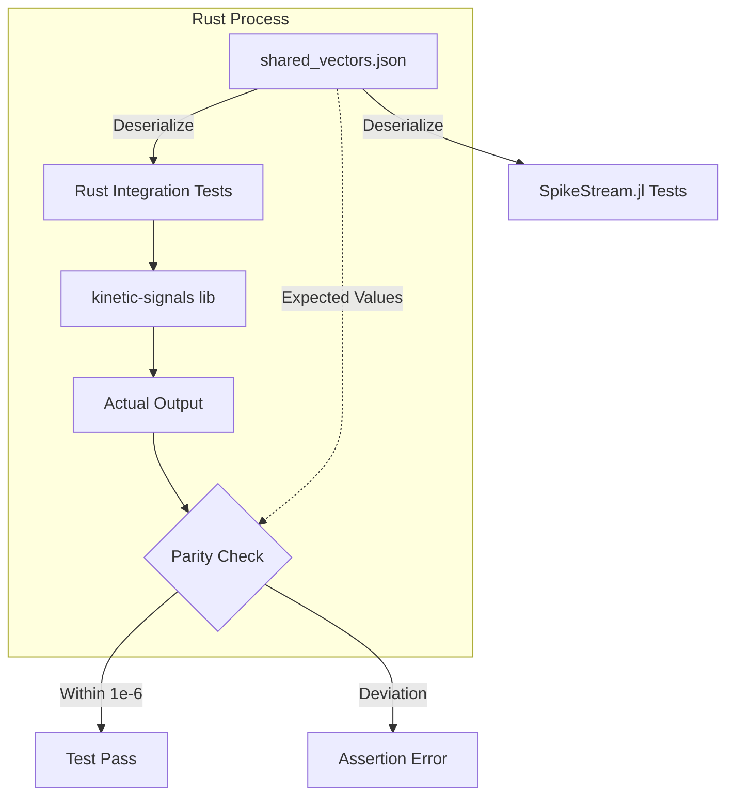
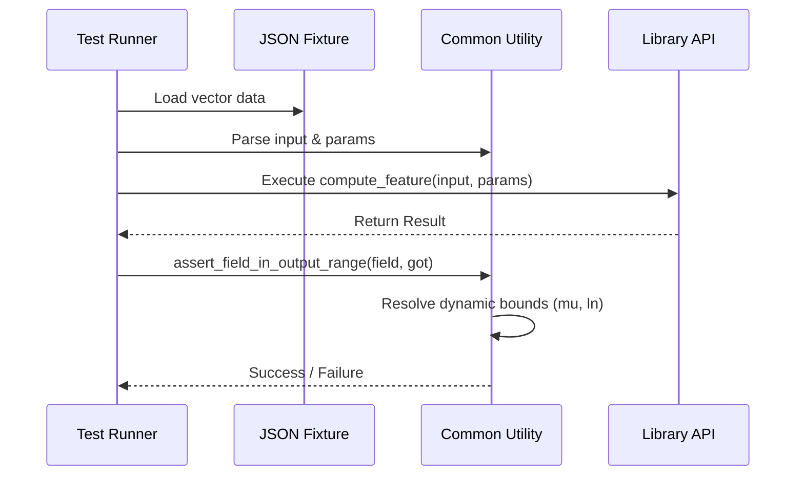

Relevant source files

The following files were used as context for generating this wiki page:

- [tests/cross\_language\_ranges.rs](tests/cross_language_ranges.rs)
- [README.md](README.md)
- [tests/fixtures/shared\_vectors.json](tests/fixtures/shared_vectors.json)
- [tests/hawkes\_fixture\_vectors.rs](tests/hawkes_fixture_vectors.rs)
- [tests/surprise\_fixture\_vectors.rs](tests/surprise_fixture_vectors.rs)
- [tests/stats\_fixture\_vectors.rs](tests/stats_fixture_vectors.rs)
- [tests/common/mod.rs](tests/common/mod.rs)
- [src/lib.rs](src/lib.rs)

# Cross-Language Output Ranges

Cross-Language Output Ranges represent a standardized set of conventions and validation mechanisms used to ensure numerical parity between the `kinetic-signals` Rust crate and its Julia counterpart, `SpikeStream.jl`. This system ensures that signal features—such as Hurst exponents, Hawkes intensity, and Shannon entropy—produce identical results across different programming environments within a defined floating-point tolerance.

The primary mechanism for this alignment is a shared "golden-vector" architecture. A JSON-based fixture file serves as the single source of truth for expected inputs and outputs. The Rust implementation uses integration tests to deserialize these vectors and assert that the library's computations remain within the specified ranges and match the "expected" values defined in the shared registry.

Sources: [README.md:144-150](README.md#L144-L150), [tests/fixtures/shared_vectors.json:1-8](tests/fixtures/shared_vectors.json#L1-L8)

## Standardized Range Conventions

To maintain consistency between Rust and Julia, the project defines strict output ranges for every feature module. These ranges act as a boundary contract for technical indicators and statistical estimators.

| Feature | Output Field | Range | Notes |
| :--- | :--- | :--- | :--- |
| **Hurst** | `h` | `[0, 1]` | Clamped to unit interval. |
| **Hawkes** | `intensity` | `[mu, +inf)` | Baseline intensity is the lower bound. |
| **Hawkes** | `avg_excitation` | `[0, +inf)` | Magnitude of self-excitation. |
| **Surprise** | `surprise` | `[0, +inf)` | Absolute z-score of log-ratio. |
| **Entropy** | `shannon` | `[0, ln(bins)]` | Complexity bounded by bin count. |
| **Entropy** | `relative` | `[0, 1]` | Normalized entropy score. |
| **Volatility** | `rms` | `[0, 1]` | Rolling RMS of absolute log-returns. |
| **Signal Stats**| `variance` | `[0, +inf)` | Population variance (non-negative). |

Sources: [README.md:152-160](0, +inf)` | Population variance (non-negative). |

Sources: [README.md:152-160), [tests/fixtures/shared_vectors.json:32-35](tests/fixtures/shared_vectors.json#L32-L35), [tests/fixtures/shared_vectors.json:101-104](tests/fixtures/shared_vectors.json#L101-L104)

## Architecture of Parity Validation

The validation system relies on a central fixture file and specialized test runners. The Rust side executes these checks through integration tests located in the `tests/` directory.

The diagram shows the shared dependency on `shared_vectors.json` to ensure both language implementations remain aligned during development.
Sources: [README.md:162-171](README.md#L162-L171), [tests/cross_language_ranges.rs:18-24](tests/cross_language_ranges.rs#L18-L24), [tests/common/mod.rs:7-12](tests/common/mod.rs#L7-L12)

### Fixture Structure and Persistence
The `shared_vectors.json` file contains a global `tolerance` (defaulting to `1e-06`) and a `vectors` object. Each vector entry defines an `input` (data and parameters), an `output_range` (numerical boundaries), and often an `expected` block for bit-exact or high-precision parity.

Key components of a vector entry include:
*  **Input Data**: Raw signal arrays or event timestamps.
*  **Parameters**: Configuration structs like `HawkesParams` or `SurpriseParams`.
*  **Output Ranges**: Dynamic bounds that may refer to parameter values like `mu` or `ln(bins)`.
*  **Expected Results**: Hardcoded values for deterministic algorithm verification.

Sources: [tests/fixtures/shared_vectors.json:3-15](tests/fixtures/shared_vectors.json#L3-L15), [tests/common/mod.rs:56-70](tests/common/mod.rs#L56-L70)

## Implementation Details

### Range Parsing and Bounds
The testing utility in `tests/common/mod.rs` implements a range parser capable of handling dynamic boundaries. It resolves string literals in the JSON fixture into concrete numerical values for assertion.

*  **Inf / -Inf**: Map to `f64::INFINITY` and `f64::NEG_INFINITY`.
*  **mu**: Resolves to the baseline intensity parameter provided in the test context.
*  **ln(bins)**: Resolves to the natural logarithm of the bin count used in entropy calculations.

Sources: [tests/common/mod.rs:55-75](tests/common/mod.rs#L55-L75)

### Test Execution Flow
Integration tests follow a standard sequence to verify cross-language parity:
1.  **Load Fixture**: Read `shared_vectors.json`.
2.  **Initialize Context**: Create a `BoundCtx` containing specific parameters (e.g., `mu`, `bins`).
3.  **Compute**: Call the library function (e.g., `compute_hurst` or `compute_shannon_entropy`).
4.  **Assert**: Check if the result is finite and falls within the range defined in the fixture, adjusted by the allowed `tolerance`.

The sequence illustrates how dynamic bounds are resolved during the assertion phase of a cross-language test.
Sources: [tests/cross_language_ranges.rs:48-65](tests/cross_language_ranges.rs#L48-L65), [tests/common/mod.rs:109-119](tests/common/mod.rs#L109-L119)

## Core Features Under Parity

### Hurst Exponent
The Hurst exponent (`h`) is verified to be deterministic and clamped within the `[0, 1]` interval. Persistence flags are derived from this value: `is_persistent` for $h > 0.52$ and `is_antipersistent` for $h < 0.48$.
Sources: [tests/cross_language_ranges.rs:48-73](tests/cross_language_ranges.rs#L48-L73), [tests/fixtures/shared_vectors.json:76-80](tests/fixtures/shared_vectors.json#L76-L80)

### Hawkes Process
For Hawkes processes, the implementation verifies both batch results and streaming updates. The `intensity` must always be $\ge \mu$. Streaming tests verify `post_event_intensity` and `new_decay_sum` against the `hawkes_streaming` and `hawkes_streaming_sequence` fixture keys.
Sources: [tests/hawkes_fixture_vectors.rs:172-192](tests/hawkes_fixture_vectors.rs#L172-L192), [tests/fixtures/shared_vectors.json:115-130](tests/fixtures/shared_vectors.json#L115-L130)

### Surprise Detection
Surprise metrics are verified across consecutive transitions. The `surprise` value is strictly non-negative ($|z\_score|$). The parity tests ensure that anomaly detection is consistent with the thresholding logic defined in `SurpriseParams`.
Sources: [tests/surprise_fixture_vectors.rs:136-160](tests/surprise_fixture_vectors.rs#L136-L160), [tests/fixtures/shared_vectors.json:204-215](tests/fixtures/shared_vectors.json#L204-L215)

### Signal Statistics
Batch statistics for mean, variance, skewness, and kurtosis are validated using the `signal_stats` and `signal_stats_skewed` vectors. The tests specifically target population moments (non-Bessel corrected) and excess kurtosis (Fisher).
Sources: [tests/stats_fixture_vectors.rs:21-48](tests/stats_fixture_vectors.rs#L21-L48), [tests/fixtures/shared_vectors.json:387-400](tests/fixtures/shared_vectors.json#L387-L400)

## Conclusion
Cross-Language Output Ranges provide the foundational stability required for the Limen-Neural ecosystem. By centralizing numerical expectations in `shared_vectors.json`, the project ensures that high-velocity signal features computed in Rust are interchangeable with Julia research environments. This enables a seamless transition from experimental analysis in `SpikeStream.jl` to real-time inference in `kinetic-signals`.
