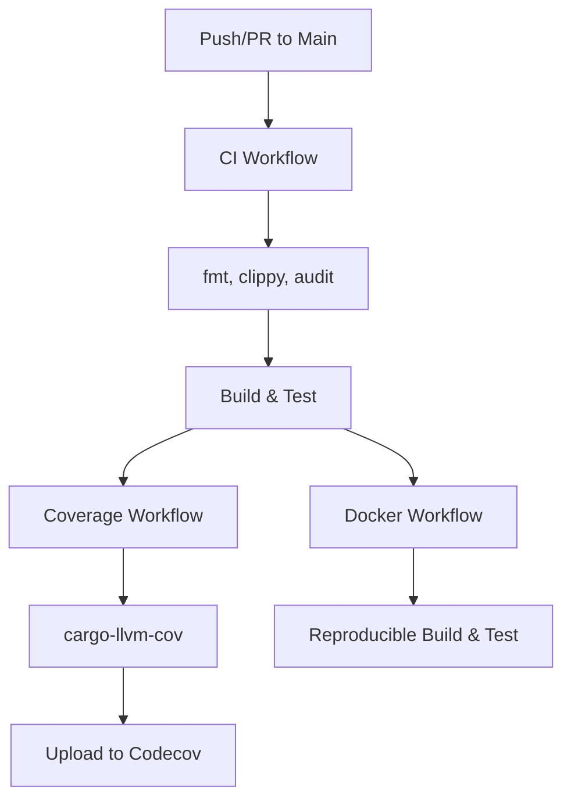
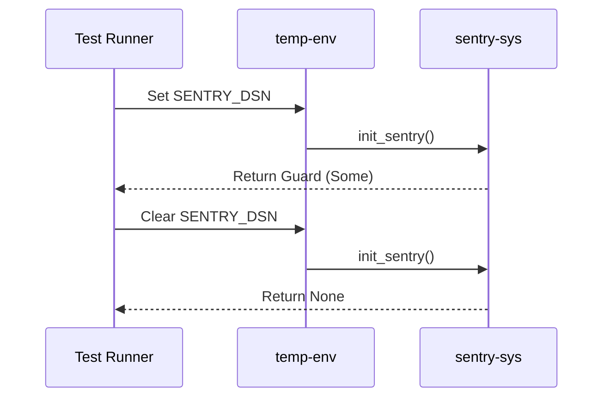

Relevant source files

The following files were used as context for generating this wiki page:

- [AGENTS.md](AGENTS.md)
- [tests/common/mod.rs](tests/common/mod.rs)
- [REVIEW.md](REVIEW.md)
- [README.md](README.md)
- [tests/fixtures/shared_vectors.json](tests/fixtures/shared_vectors.json)
- [tests/hawkes_fixture_vectors.rs](tests/hawkes_fixture_vectors.rs)
- [tests/surprise_fixture_vectors.rs](tests/surprise_fixture_vectors.rs)
- [tests/sentry_feature.rs](tests/sentry_feature.rs)

# Testing Strategy

The testing strategy for `kinetic-signals` focuses on ensuring the correctness, performance, and cross-language parity of streaming signal feature extraction algorithms. The project employs a multi-layered testing approach, including unit tests for internal logic, integration tests for public APIs, and specialized golden-vector tests to maintain alignment with the `SpikeStream.jl` Julia implementation.

Sources: [README.md:104-122](README.md#L104-L122), [AGENTS.md:73-77](AGENTS.md#L73-L77)

## Test Architecture and Organization

The project organizes tests into three primary levels to ensure comprehensive coverage and behavioral consistency.

### Hierarchical Structure
*  **Unit Tests:** Located within `src/` as inline `#[cfg(test)]` modules, focusing on individual function correctness and internal logic.
*  **Integration Tests:** Housed in the `tests/` directory, these validate the public API and feature-gated functionality like Sentry integration.
*  **Cross-Language Parity:** Utilizes a shared JSON fixture to ensure the Rust implementation produces identical results to the Julia ecosystem.

Sources: [AGENTS.md:73-77](AGENTS.md#L73-L77), [README.md:112-122](README.md#L112-L122)

### Automated Testing Workflow
The project uses GitHub Actions to automate the testing lifecycle, ensuring high standards for code quality and security.

The automated pipeline ensures that every change is validated across different toolchains (MSRV 1.85.0) and environments.
Sources: [AGENTS.md:58-65](AGENTS.md#L58-L65), [REVIEW.md:5-20](REVIEW.md#L5-L20)

## Golden Vector Parity Testing

A core component of the testing strategy is the use of "golden vectors" to maintain consistency with `SpikeStream.jl`. These tests verify that Rust-computed features like Hurst exponent, Hawkes intensity, and Surprise metrics fall within documented tolerances.

### Shared Fixture Mechanism
The project includes a `shared_vectors.json` file which contains input data, parameters, and expected output ranges. The test runner deserializes these fixtures using `serde_json` and performs precision-aware assertions.

Sources: [AGENTS.md:37-41](AGENTS.md#L37-L41), [tests/common/mod.rs:7-14](tests/common/mod.rs#L7-L14), [tests/fixtures/shared_vectors.json:1-10](tests/fixtures/shared_vectors.json#L1-L10)

### Parity Test Suite
Specific integration tests are dedicated to verifying different signal features against the shared fixtures:
| Test File | Feature Validated | Key Logic |
|-----------|-------------------|-----------|
| `hawkes_fixture_vectors.rs` | Hawkes Process | Validates batch and streaming intensity updates. |
| `surprise_fixture_vectors.rs` | Surprise Detection | Checks anomaly flags and z-score calculations. |
| `cross_language_ranges.rs` | Hurst, Entropy, Volatility | Verifies outputs are within `[0, 1]` or defined bounds. |
| `stats_fixture_vectors.rs` | Signal Stats | Validates Mean, Variance, Skewness, and Kurtosis. |

Sources: [README.md:126-135](README.md#L126-L135), [tests/hawkes_fixture_vectors.rs:1-10](tests/hawkes_fixture_vectors.rs#L1-L10), [tests/surprise_fixture_vectors.rs:1-10](tests/surprise_fixture_vectors.rs#L1-L10)

## Feature and Environment Testing

The strategy includes specialized handling for feature-gated code and environment-dependent behavior.

### Sentry Integration Tests
The optional `sentry` feature is tested to ensure that the SDK initializes correctly only when the `SENTRY_DSN` is present. These tests use `serial_test` to prevent interference during environment variable manipulation.

Sources: [tests/sentry_feature.rs:10-25](tests/sentry_feature.rs#L10-L25), [AGENTS.md:37-41](AGENTS.md#L37-L41)

### Safety and Threading
The library performs compile-time assertions to ensure all public types (e.g., `VolEstimator`, `HurstResult`, `HawkesParams`) are `Send + Sync`. This guarantees thread-safety for high-velocity streaming applications.
Sources: [src/lib.rs:88-105](src/lib.rs#L88-L105)

## Review and Merge Criteria

Testing is strictly enforced through the code review process. All PRs must meet defined criteria before merging:
*  **Coverage Thresholds:** Monitored via Codecov; `patch` coverage targets 0% with a 100% threshold for regression.
*  **Static Analysis:** `cargo clippy` must pass with `-D warnings` across all features.
*  **Review Decisons:** Zero unresolved threads and all CI checks passing (no `FAILURE` or `ACTION_REQUIRED`).

Sources: [REVIEW.md:46-52](REVIEW.md#L46-L52), [codecov.yml:1-7](codecov.yml#L1-L7), [AGENTS.md:67-71](AGENTS.md#L67-L71)

## Conclusion
The `kinetic-signals` testing strategy prioritizes mathematical accuracy and cross-platform consistency. By combining standard Rust testing patterns with shared golden-vector fixtures and automated CI/CD pipelines, the project ensures that its high-performance signal processing primitives remain reliable across the `Limen-Neural` ecosystem.
