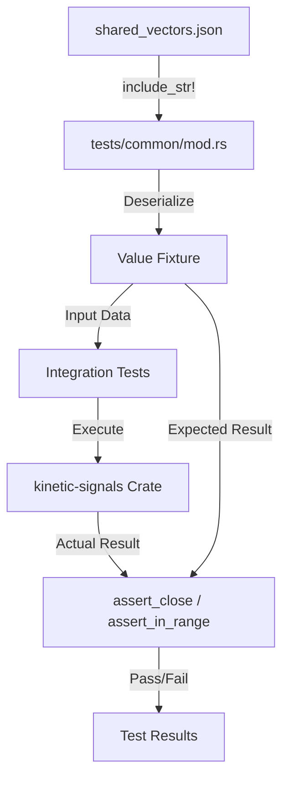
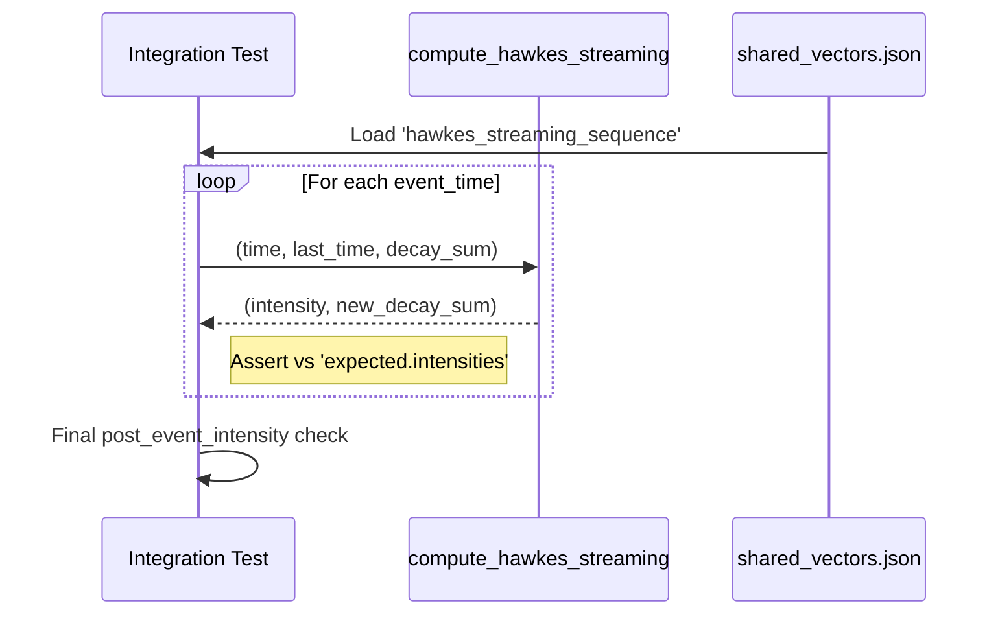

Relevant source files

The following files were used as context for generating this wiki page:

- [tests/fixtures/shared\_vectors.json](tests/fixtures/shared_vectors.json)
- [tests/hawkes\_fixture\_vectors.rs](tests/hawkes_fixture_vectors.rs)
- [tests/stats\_fixture\_vectors.rs](tests/stats_fixture_vectors.rs)
- [tests/surprise\_fixture\_vectors.rs](tests/surprise_fixture_vectors.rs)
- [tests/common/mod.rs](tests/common/mod.rs)
- [tests/cross_language_ranges.rs](tests/cross_language_ranges.rs)
- [README.md](README.md)

# Shared Fixtures Testing

Shared Fixtures Testing in the `kinetic-signals` project refers to a cross-language validation framework designed to ensure parity between the Rust implementation and the Julia `SpikeStream.jl` implementation. By utilizing a single JSON file containing "golden" test vectors, the project maintains consistent behavior for streaming signal feature extraction across different technical environments.

Sources: [README.md:144-149](README.md#L144-L149), [tests/fixtures/shared\_vectors.json:3-5](tests/fixtures/shared\_vectors.json#L3-L5)

## Architecture and Data Flow

The testing architecture centers around `tests/fixtures/shared_vectors.json`, which serves as the source of truth for expected outputs. Integration tests in Rust load this file, parse the input parameters, execute the library functions, and assert that the results match the "golden" values within a specified numeric tolerance.

The following diagram illustrates the flow from the shared fixture file to the test assertions:

The testing suite is decentralized into specialized integration test files (e.g., `hawkes_fixture_vectors.rs`, `surprise_fixture_vectors.rs`) that utilize shared logic in `tests/common/mod.rs` to validate specific algorithms.

Sources: [tests/common/mod.rs:7-13](tests/common/mod.rs#L7-L13), [tests/cross_language_ranges.rs:16-35](tests/cross_language_ranges.rs#L16-L35), [tests/hawkes\_fixture\_vectors.rs:105-115](tests/hawkes\_fixture\_vectors.rs#L105-L115)

## Core Components

### Shared Fixture Loader (`common/mod.rs`)
This module provides the primitive functions required to load the JSON fixture and perform fuzzy equality checks on floating-point numbers. It handles the extraction of numeric tolerances and the parsing of range endpoints like "Inf" or "mu".

| Function | Purpose |
| :--- | :--- |
| `fixture()` | Loads and deserializes `shared_vectors.json` using `serde_json`. |
| `tol(v: &Value)` | Retrieves the specific tolerance for a vector, falling back to the root tolerance. |
| `assert_close(check: CloseCheck)` | Asserts that the difference between `got` and `expected` is within `tolerance`. |
| `assert_field_in_output_range` | Validates that a result falls within a defined [lo, hi] interval. |

Sources: [tests/common/mod.rs:10-22](tests/common/mod.rs#L10-L22), [tests/common/mod.rs:36-45](tests/common/mod.rs#L36-L45), [tests/common/mod.rs:114-122](tests/common/mod.rs#L114-L122)

### Feature Vectors and Ranges
The project defines specific output ranges for each feature to ensure mathematical consistency. These ranges are validated against the `output_range` definitions in the JSON fixture.

| Feature | Output Field | Expected Range |
| :--- | :--- | :--- |
| Hurst | `h` | `[0, 1]` |
| Hawkes | `intensity` | `[mu, +inf)` |
| Surprise | `surprise` | `[0, +inf)` |
| Entropy | `relative` | `[0, 1]` |
| Volatility | `rms` | `[0, 1]` |

Sources: [README.md:154-162](README.md#L154-L162), [tests/fixtures/shared\_vectors.json:117-124](tests/fixtures/shared\_vectors.json#L117-L124)

## Validation Logic by Feature

### Hawkes Process Validation
The Hawkes process is validated using both batch and streaming vectors. The streaming tests simulate a "walk" through event times, maintaining a `decay_sum` across calls to `compute_hawkes_streaming`.

Sources: [tests/hawkes\_fixture\_vectors.rs:55-73](tests/hawkes\_fixture\_vectors.rs#L55-L73), [tests/fixtures/shared\_vectors.json:141-155](tests/fixtures/shared\_vectors.json#L141-L155)

### Surprise Detection (Anomaly Metrics)
Surprise testing involves validating the `z_score` and `surprise` metrics for transitions between values. The fixture includes `surprise_sequence_drift` to test behavior when a non-zero drift (`mu`) is present.

*  **Logic:** `z_score = (log_return - (mu * dt)) / (sigma * sqrt(dt))`.
*  **Anomaly Flag:** A transition is marked as an anomaly if `surprise > threshold`.

Sources: [tests/surprise\_fixture\_vectors.rs:46-75](tests/surprise\_fixture\_vectors.rs#L46-L75), [tests/fixtures/shared\_vectors.json:237-250](tests/fixtures/shared\_vectors.json#L237-L250)

### Signal Statistics
Validates high-order moments including Mean, Variance, Skewness, and Kurtosis. The integration test `stats_fixture_vectors.rs` ensures that the population moments calculated by the library match the expected values in the `signal_stats` and `signal_stats_skewed` fixture entries.

Sources: [tests/stats\_fixture\_vectors.rs:17-48](tests/stats\_fixture\_vectors.rs#L17-L48), [tests/fixtures/shared\_vectors.json:374-386](tests/fixtures/shared\_vectors.json#L374-L386)

## Summary of Test Vectors

The `shared_vectors.json` file contains multiple scenarios for each algorithm:

*  **Hurst:** Clamped values within the unit interval to detect persistence.
*  **Hawkes:** Basic batch, single-step streaming, and full sequences with resume capability (using `initial_decay_sum`).
*  **Surprise:** Individual spikes, sequence transitions with zero drift, and sequences with non-default drift/volatility.
*  **Signal Stats:** Standard symmetric data and right-skewed data with outliers.

Sources: [tests/cross\_language\_ranges.rs:20-39](tests/cross\_language\_ranges.rs#L20-L39), [tests/fixtures/shared\_vectors.json:32-38](tests/fixtures/shared\_vectors.json#L32-L38)

Shared Fixtures Testing ensures that any optimization or refactoring in the Rust codebase does not deviate from the established mathematical models shared with the Julia ecosystem, maintaining the library's reliability for high-velocity stochastic signal processing.
