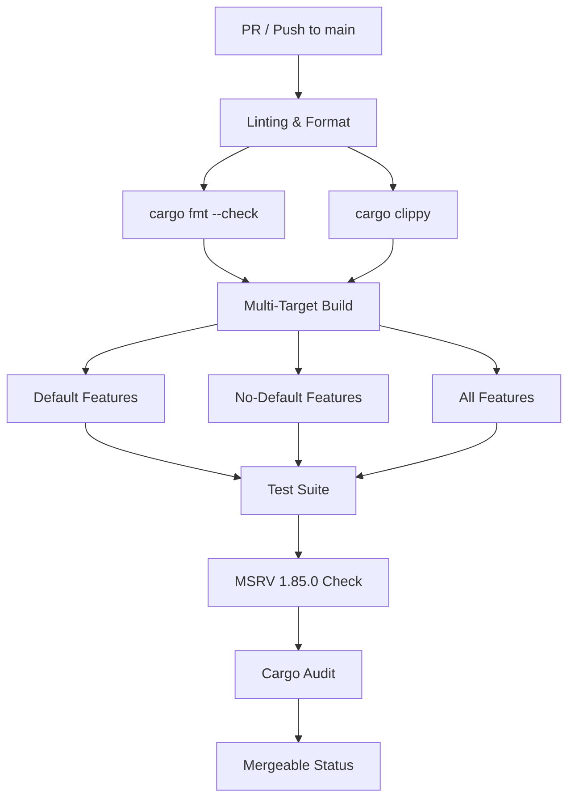
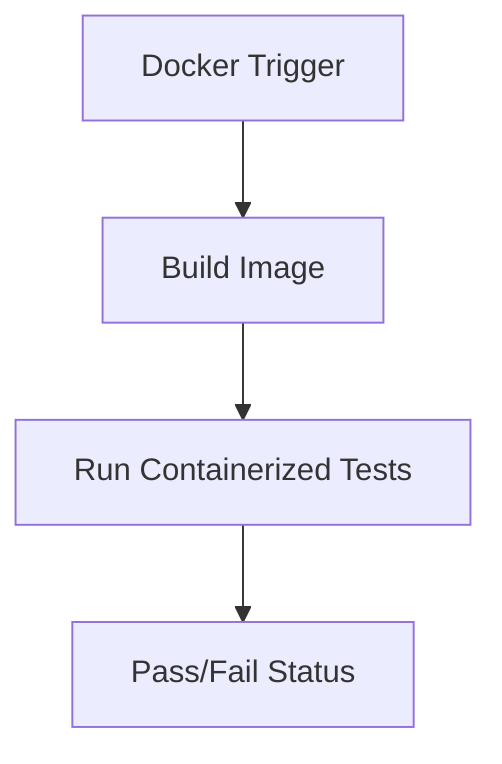

<details>
<summary>Relevant source files</summary>

The following files were used as context for generating this wiki page:

- [AGENTS.md](AGENTS.md)
- [REVIEW.md](REVIEW.md)
- [README.md](README.md)
- [Cargo.toml](Cargo.toml)
- [codecov.yml](codecov.yml)
- [tests/sentry_feature.rs](tests/sentry_feature.rs)
</details>

# CI Workflows Overview

Continuous Integration (CI) in the `kinetic-signals` project is designed to ensure code correctness, performance, security, and cross-language parity for high-velocity signal processing. The pipeline automates formatting checks, linting, multi-feature builds, unit/integration testing, and coverage reporting.

The CI environment specifically targets the Rust 2024 edition, maintaining a Minimum Supported Rust Version (MSRV) of 1.85.0. It integrates specialized tools like `cargo-llvm-cov` for coverage and `cargo audit` for dependency security, while managing optional integrations like Sentry through feature-gated workflows.

Sources: [AGENTS.md:46-51](AGENTS.md#L46-L51), [README.md:92-95](README.md#L92-L95), [Cargo.toml:7-9](Cargo.toml#L7-L9)

## Workflow Architecture and Triggers

The project utilizes four primary GitHub Action workflows triggered by pushes or pull requests to the `main` branch, as well as specific tag events for releases.

| Workflow | Trigger | Primary Actions |
| :--- | :--- | :--- |
| `ci.yml` | Push/PR to `main` | `fmt`, `clippy`, `build`, `test`, MSRV check, `cargo audit` |
| `coverage.yml` | Push/PR to `main` | `cargo-llvm-cov`, Codecov upload |
| `docker.yml` | Push/PR to `main` | Containerized build and test |
| `sentry-release.yml` | Tag push `v*` | Creates Sentry release |

Sources: [AGENTS.md:88-93](AGENTS.md#L88-L93), [README.md:110-114](README.md#L110-L114)

### CI Pipeline Flow
The following diagram illustrates the standard execution flow for a code contribution via Pull Request.



The CI process ensures that the library remains functional across various feature combinations, including the optional `sentry` integration.
Sources: [AGENTS.md:53-61](AGENTS.md#L53-L61), [AGENTS.md:89](AGENTS.md#L89)

## Verification and Quality Gates

### Automated Code Review (Bots)
Automated reviews are conducted by several specialized bots to enforce security and architectural standards.

*  **Codacy**: Focuses on security (e.g., SHA pinning of actions) and code complexity. It excludes markdown and test fixtures from its analysis.
*  **Devin**: Monitors behavioral consistency and ensures caching is utilized to optimize CI speed.
*  **CodeRabbit**: Enforces least-privilege permissions, specifically checking for `persist-credentials: false`.
*  **Kilo Code & Cursor**: Provide suggestions for general code improvements and bug detection.

Sources: [REVIEW.md:27-33](REVIEW.md#L27-L33)

### Coverage Reporting
Coverage is calculated using `cargo-llvm-cov` and reported via Codecov. The project maintains a strict coverage policy where the default patch target is 0% with a 100% threshold for reported lines, ensuring that new code does not lower the overall coverage quality.

```yaml
coverage:
  status:
    patch:
      default:
        target: 0%
        threshold: 100%

ignore:
  - "docs/**"
  - "examples/**"
  - "tests/fixtures/**"
```

Sources: [codecov.yml:1-12](codecov.yml#L1-L12), [README.md:103-107](README.md#L103-L107)

## Testing Infrastructure

### Feature-Gated Testing
Tests are partitioned based on Cargo features. The `sentry` feature requires specific environment handling and system dependencies (like `libssl-dev` and `pkg-config`) to successfully compile and run in CI.

*  **Unit Tests**: Located inline within `src/` files using `#[cfg(test)]`.
*  **Integration Tests**: Located in `tests/`, including environment variable manipulation tests using `temp-env` and `serial_test`.
*  **Cross-Language Parity**: Verified against `tests/fixtures/shared_vectors.json` to ensure consistency with the Julia `SpikeStream.jl` implementation.

Sources: [AGENTS.md:76-80](AGENTS.md#L76-L80), [AGENTS.md:110-116](AGENTS.md#L110-L116), [tests/sentry_feature.rs:10-15](tests/sentry_feature.rs#L10-L15)

### Reproducible Builds (Docker)
A `docker.yml` workflow manages containerized builds to ensure environment-agnostic reproducibility.



Sources: [AGENTS.md:91](AGENTS.md#L91), [README.md:116-119](README.md#L116-L119)

## Merge and Release Requirements

Before a Pull Request can be merged, it must satisfy specific CI and review criteria:
1.  **CI Checks**: All checks must pass (no `FAILURE` or `ACTION_REQUIRED`).
2.  **Parity**: All tests involving `shared_vectors.json` must match within a `1e-06` tolerance.
3.  **Security**: Action pins must use SHAs rather than mutable tags.
4.  **Bot Resolution**: Every bot thread must be addressed or substantively answered.
5.  **Release Creation**: Tagging a commit with `v*` automatically triggers the `sentry-release.yml` workflow, which links the library version (e.g., `kinetic-signals@0.4.0`) to Sentry monitoring.

Sources: [REVIEW.md:43-48](REVIEW.md#L43-L48), [README.md:154-159](README.md#L154-L159), [AGENTS.md:93](AGENTS.md#L93)

The CI infrastructure ensures that `kinetic-signals` maintains its high-performance profile (e.g., Surprise detection at ~100ns) while remaining a zero-dependency library for users who do not opt into additional features.
Sources: [README.md:126-130](README.md#L126-L130), [Cargo.toml:13-20](Cargo.toml#L13-L20)
