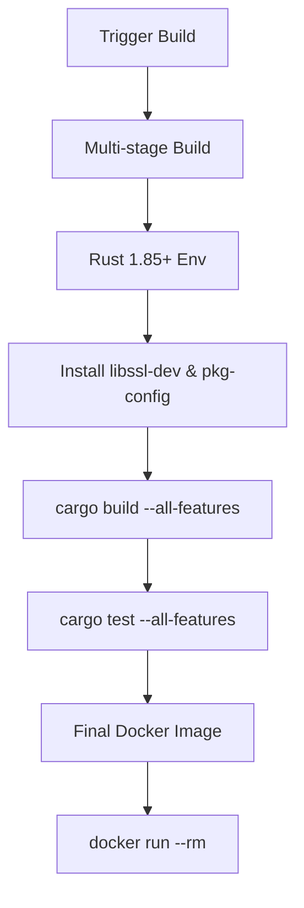
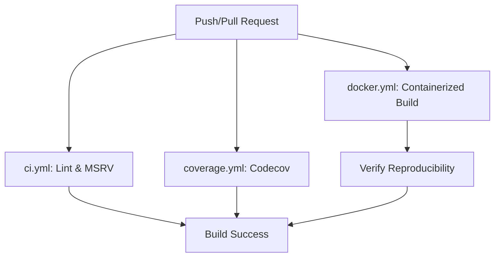

<details>
<summary>Relevant source files</summary>

The following files were used as context for generating this wiki page:

- [README.md](README.md)
- [REVIEW.md](REVIEW.md)
- [AGENTS.md](AGENTS.md)
- [Cargo.toml](Cargo.toml)
- [examples/demo.rs](examples/demo.rs)

</details>

# Docker Containerization

Docker containerization in the `kinetic-signals` project provides a reproducible environment for building and testing the library crate. It ensures consistent toolchain versions, specifically maintaining the Minimum Supported Rust Version (MSRV) of 1.85.0, and manages system-level dependencies required for optional features like Sentry error monitoring.

The containerization strategy supports the crate's goal of high-performance, domain-agnostic signal feature extraction by isolating the build environment from local host variations. This is particularly important for verifying cross-language parity and maintaining performance benchmarks across different environments.

Sources: [README.md:1-10](README.md#L1-L10), [AGENTS.md:34-40](AGENTS.md#L34-L40), [AGENTS.md:120-125](AGENTS.md#L120-L125)

## Build Architecture and Hygiene

The project utilizes a `Dockerfile` designed with multi-stage hygiene to optimize the build process and minimize the final image size. The containerization process is integrated into the project's Continuous Integration (CI) workflows, specifically triggered on pushes to the `main` branch and in pull requests.

### Container Lifecycle Flow
The following diagram illustrates the lifecycle of the Docker container from build to execution within the project environment.



The workflow ensures that every commit satisfies build and test requirements in a clean, isolated environment.

Sources: [REVIEW.md:25](REVIEW.md#L25), [AGENTS.md:65-68](AGENTS.md#L65-L68), [README.md:94-98](README.md#L94-L98)

## System Dependencies and Features

While the library is self-contained by default with zero required runtime dependencies, certain features enabled during containerization require specific system-level packages. The `sentry` feature, used for error monitoring, introduces a dependency on `openssl-sys`, which must be handled within the Docker environment.

### Required System Packages
| Package | Role | Required By |
| :--- | :--- | :--- |
| `libssl-dev` | OpenSSL headers and libraries | `sentry` feature |
| `pkg-config` | Helper tool for locating libraries | `sentry` feature |
| `rustc` >= 1.85 | Core Rust compiler (Edition 2024) | Project Core |

Sources: [AGENTS.md:43-50](AGENTS.md#L43-L50), [AGENTS.md:126-130](AGENTS.md#L126-L130), [Cargo.toml:14-20](Cargo.toml#L14-L20)

### Build Configuration Commands
To perform a reproducible build and run tests within the container, the following commands are utilized:

```bash
# Build the image with the kinetic-signals tag
docker build -t kinetic-signals .

# Run the containerized tests and application demo
docker run --rm kinetic-signals
```

Sources: [README.md:118-121](README.md#L118-L121)

## CI/CD Integration

The Docker containerization is a core component of the automated validation pipeline. The `docker.yml` workflow automates the containerized build and test process to ensure that environment-specific issues do not affect the library's reliability.

### CI Workflow Relationships
This diagram shows how Docker containerization fits into the broader CI/CD ecosystem of the crate.



Sources: [AGENTS.md:65-68](AGENTS.md#L65-L68), [README.md:94-98](README.md#L94-L98)

## Runtime Environment and Features

When running the containerized application (such as the `demo.rs` example), the environment can be configured to support optional observability. If the `sentry` feature is enabled in the Docker build, the container expects specific environment variables to function correctly.

### Environment Configuration
| Variable | Description | Usage |
| :--- | :--- | :--- |
| `SENTRY_DSN` | Data Source Name for Sentry | Enables error reporting in `demo.rs` |

The `init_sentry()` function in `src/lib.rs` checks for this variable at runtime. If the `sentry` feature is compiled into the Docker image, the initialization logic will execute only if `SENTRY_DSN` is non-empty.

Sources: [src/lib.rs:55-75](src/lib.rs#L55-L75), [examples/demo.rs:27-28](examples/demo.rs#L27-L28), [AGENTS.md:58-61](AGENTS.md#L58-L61)

## Conclusion

Docker containerization for `kinetic-signals` serves as the authoritative verification environment for the library's high-performance signal processing APIs. By encapsulating the Rust 1.85.0 toolchain and OpenSSL dependencies, it guarantees that features like Hawkes process modeling, Hurst exponent calculation, and Sentry integration remain stable and performant across diverse deployment targets.

Sources: [README.md:13-25](README.md#L13-L25), [AGENTS.md:120-135](AGENTS.md#L120-L135)
