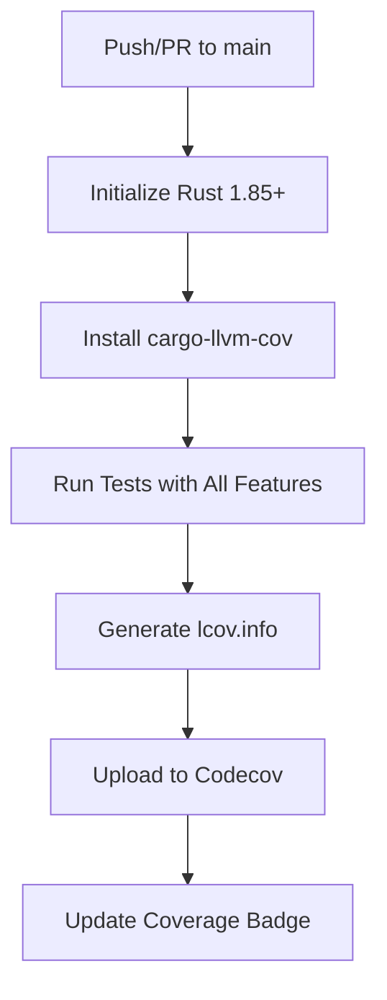

Relevant source files

The following files were used as context for generating this wiki page:

- [codecov.yml](codecov.yml)
- [README.md](README.md)
- [REVIEW.md](REVIEW.md)
- [AGENTS.md](AGENTS.md)
- [Cargo.toml](Cargo.toml)

# Code Coverage & Codecov

The `kinetic-signals` crate employs a robust code coverage infrastructure to ensure the reliability and correctness of its streaming signal feature extraction algorithms. This system integrates local developer tools with automated cloud-based reporting via Codecov, providing transparent metrics for both maintenance and external contributions. 

Coverage tracking is a core component of the project's CI/CD pipeline, ensuring that new features like the Hurst Exponent, Hawkes Process, and Surprise Anomaly Detection are thoroughly validated against shared test vectors. The project maintains a strict policy where coverage reports are automatically generated and uploaded to Codecov on every push to the `main` branch and within pull requests.

Sources: [README.md:1-15](README.md#L1-L15), [AGENTS.md:58-62](AGENTS.md#L58-L62)

## Coverage Infrastructure & Tooling

The project utilizes `cargo-llvm-cov` as the primary engine for generating coverage data. This tool allows developers to visualize code execution paths both locally and in CI environments.

### Local Development Workflow
Developers can generate coverage reports locally to verify test completeness before submitting code. The following commands are used for local analysis:

*  **LCOV Generation:** `cargo llvm-cov --all-features --workspace --lcov --output-path lcov.info`
*  **HTML Visualization:** `cargo llvm-cov --all-features --workspace --open`

Sources: [README.md:92-98](README.md#L92-L98), [AGENTS.md:60](AGENTS.md#L60)

### CI/CD Integration
The coverage process is automated through a dedicated GitHub Actions workflow. The workflow performs the following sequence:

The diagram shows the automated lifecycle of a coverage report from code submission to public metric updates.
Sources: [README.md:100-105](README.md#L100-L105), [AGENTS.md:60](AGENTS.md#L60), [AGENTS.md:37-38](AGENTS.md#L37-L38)

## Codecov Configuration

The behavior of the Codecov integration is defined in the `codecov.yml` file. This configuration sets the success criteria for pull requests and identifies paths that should be excluded from coverage metrics.

### Coverage Thresholds
The project implements a "patch" coverage policy, which evaluates the coverage of newly added code in pull requests.

| Parameter | Value | Description |
|:---|:---|:---|
| Target | 0% | The minimum total coverage required for a patch (lax by default). |
| Threshold | 100% | The allowable drop in coverage for a patch before failing. |

Sources: [codecov.yml:2-7](codecov.yml#L2-L7)

### Ignored Paths
To ensure metrics focus on the core library logic in `src/`, several directories and file types are excluded from coverage calculations:

*  Documentation (`docs/**`, `*.md`)
*  CI/CD Workflows (`.github/**`)
*  Example code (`examples/**`)
*  Static test fixtures (`tests/fixtures/**`)

Sources: [codecov.yml:9-14](codecov.yml#L9-L14)

## Review & Merge Criteria

Code coverage is a required metric during the peer review process. According to the project's review guidelines, coverage thresholds and ignore paths must be verified to ensure they match the architectural intent and do not hide security-relevant paths.

### Merge Requirements
*  **Check Status:** All CI checks, including the coverage workflow, must pass.
*  **Zero Regression:** Reviewers check `codecov.yml` to ensure coverage isn't being artificially inflated by excluding complex code.
*  **Exceptions:** Documentation-only pull requests may skip coverage checks with maintainer approval.

Sources: [REVIEW.md:16-25](REVIEW.md#L16-L25), [REVIEW.md:65-72](REVIEW.md#L65-L72), [AGENTS.md:83-85](AGENTS.md#L83-L85)

### Automation & Bots
Codecov acts alongside other bots (Codacy, CodeRabbit) to maintain code quality. While Codacy focuses on security and complexity, Codecov focuses specifically on the execution of code paths within `src/` modules such as `hurst.rs`, `hawkes.rs`, and `stats.rs`.

Sources: [REVIEW.md:34-40](REVIEW.md#L34-L40), [AGENTS.md:13-22](AGENTS.md#L13-L22)

## Summary

Code coverage in `kinetic-signals` is a mandatory quality gate that combines `cargo-llvm-cov` for data generation and Codecov for visualization and enforcement. By excluding non-functional artifacts and enforcing strict review of configuration changes, the project ensures that its high-performance signal processing logic remains verified and maintainable across versions.
