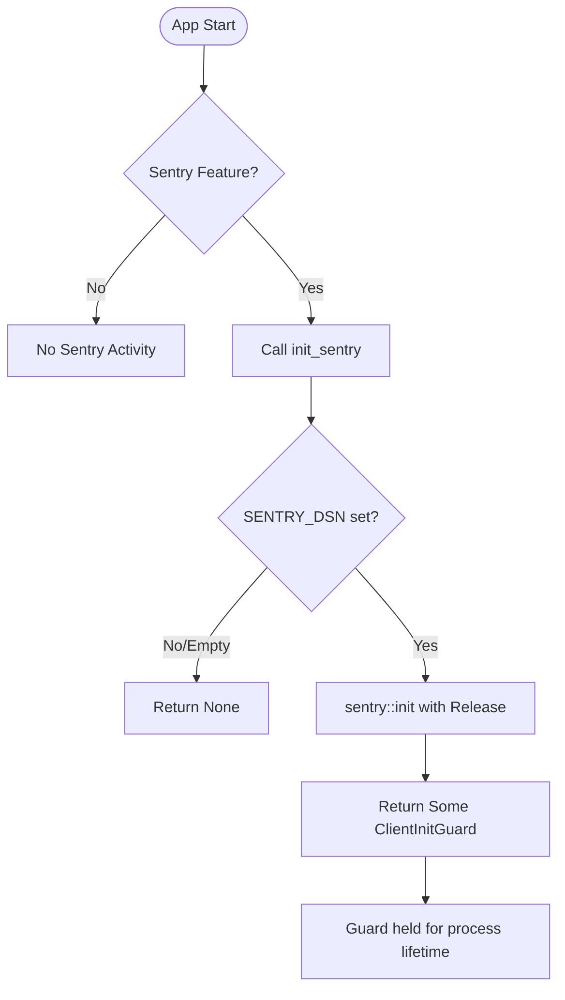
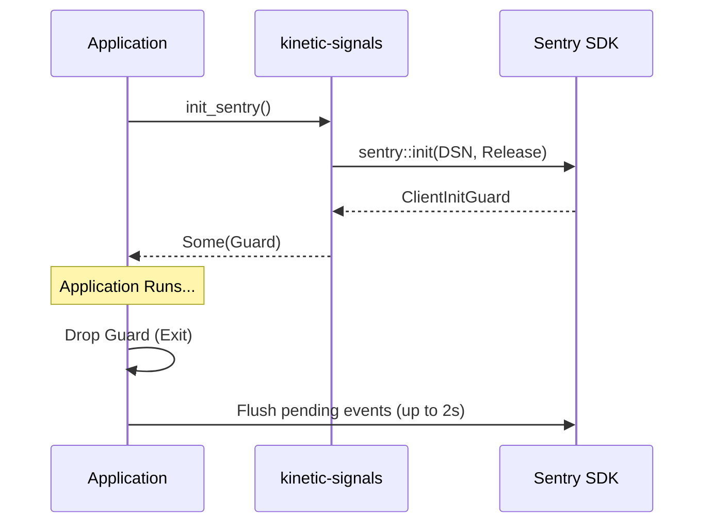

<details>
<summary>Relevant source files</summary>

The following files were used as context for generating this wiki page:

- [README.md](README.md)
- [AGENTS.md](AGENTS.md)
- [src/lib.rs](src/lib.rs)
- [REVIEW.md](REVIEW.md)
- [Cargo.toml](Cargo.toml)
- [tests/sentry_feature.rs](tests/sentry_feature.rs)
- [examples/demo.rs](examples/demo.rs)
</details>

# Sentry Release Automation

Sentry Release Automation in the `kinetic-signals` project provides opt-in error monitoring and observability for high-velocity signal processing. It allows developers to track anomalies and runtime errors by integrating the Sentry SDK, which is managed through a specific feature gate and environment-driven configuration.

The automation is tied to the project's CI/CD lifecycle, specifically triggering on versioned tag pushes to synchronize Sentry releases with the crate's deployment version. This ensures that any captured errors are correctly attributed to the specific version of the code in production.

Sources: [README.md:195-218](README.md#L195-L218), [AGENTS.md:65-71](AGENTS.md#L65-L71), [src/lib.rs:52-73](src/lib.rs#L52-L73)

## Architecture and Integration

The Sentry integration is designed to be zero-cost when disabled. It is controlled by the `sentry` feature flag in `Cargo.toml`. When enabled, the library provides a specialized initialization function that interacts with the `sentry` crate (version 0.48.2).

### Component Overview

| Component | Description |
|-----------|-------------|
| `sentry` Feature | A Cargo feature gate that includes the `sentry` dependency and enables Sentry-related code. |
| `init_sentry()` | The public entry point in `src/lib.rs` for starting the Sentry client. |
| `SENTRY_DSN` | An environment variable used to provide the Data Source Name for the Sentry project. |
| `sentry-release.yml` | A GitHub Actions workflow that automates Sentry release creation on tag pushes. |

Sources: [Cargo.toml:19-25](Cargo.toml#L19-L25), [src/lib.rs:52-59](src/lib.rs#L52-L59), [AGENTS.md:69-71](AGENTS.md#L69-L71)

### Initialization Flow

The initialization logic checks for the presence of the `SENTRY_DSN` environment variable. If the DSN is missing or empty, Sentry is not initialized, ensuring no data is sent by default.



The `init_sentry()` function automatically sets the Sentry release name using `sentry::release_name!()`, which follows the format `CARGO_PKG_NAME@CARGO_PKG_VERSION` (e.g., `kinetic-signals@0.4.0`).

Sources: [src/lib.rs:60-72](src/lib.rs#L60-L72), [README.md:214-216](README.md#L214-L216)

## Release Workflow

The automation of Sentry releases is managed through GitHub Actions. This process ensures that Sentry is aware of new deployments and can associate errors with the correct codebase version.

### Trigger Mechanism

The release automation is triggered by a specific event in the repository:
*  **Trigger:** Push of a tag matching the pattern `v*` (e.g., `v0.4.0`).
*  **Action:** The `sentry-release.yml` workflow executes to create a matching Sentry release.

Sources: [AGENTS.md:69-71](AGENTS.md#L69-L71), [README.md:216-218](README.md#L216-L218)

### Lifecycle Management

When Sentry is initialized, it returns a `ClientInitGuard`. This guard is critical for the "Automation" aspect of error reporting, as it handles the flushing of pending events before the application exits.



Sources: [src/lib.rs:54-57](src/lib.rs#L54-L57), [README.md:209-211](README.md#L209-L211), [examples/demo.rs:27-28](examples/demo.rs#L27-L28)

## Implementation Details

### Feature Gating
The Sentry functionality is strictly isolated using Rust's `#[cfg(feature = "sentry")]` attribute. This applies to the `init_sentry` function and related tests.

```rust
#[cfg(feature = "sentry")]
pub fn init_sentry() -> Option<sentry::ClientInitGuard> {
    // ... logic to check SENTRY_DSN and init
}
```

Sources: [src/lib.rs:59](src/lib.rs#L59), [tests/sentry_feature.rs:8](tests/sentry_feature.rs#L8)

### Development and Testing
Release automation and initialization are verified using serial tests that manipulate environment variables to simulate various deployment scenarios.

*  **Initialization Test:** Verifies that Sentry starts when a DSN is provided.
*  **No-DSN Test:** Verifies that Sentry remains inactive when the DSN is absent.
*  **Demo Integration:** The project includes a demo that can be run with `SENTRY_DSN=... cargo run --example demo --features sentry` to exercise the integration.

Sources: [tests/sentry_feature.rs:13-31](tests/sentry_feature.rs#L13-L31), [examples/demo.rs:27-28](examples/demo.rs#L27-L28), [AGENTS.md:46-47](AGENTS.md#L46-L47)

## Conclusion

Sentry Release Automation in `kinetic-signals` provides a robust, opt-in mechanism for error monitoring that is tightly integrated with the project's release cycle. By leveraging GitHub Actions for release creation and Rust's feature system for zero-overhead integration, the system ensures that high-velocity signal processing remains observable without compromising performance or privacy by default.
