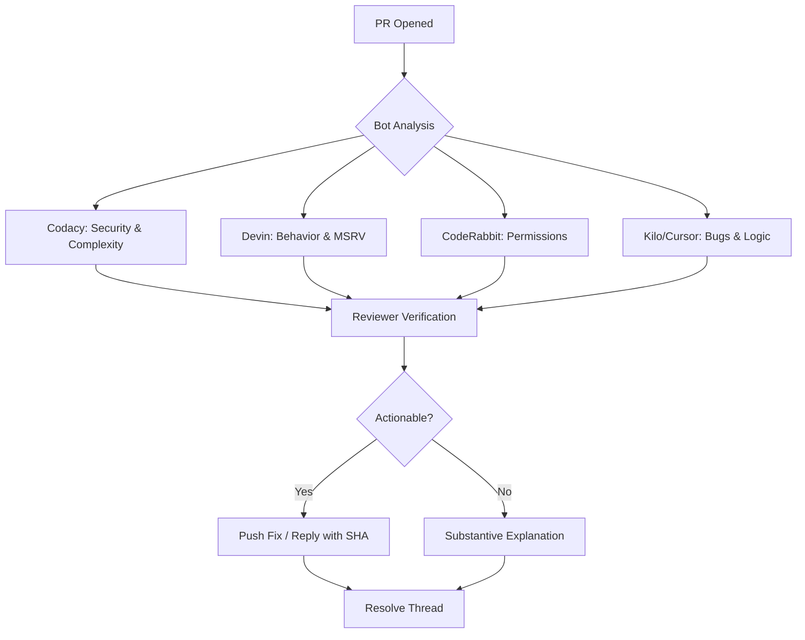

<details>
<summary>Relevant source files</summary>

The following files were used as context for generating this wiki page:

- [REVIEW.md](REVIEW.md)
- [AGENTS.md](AGENTS.md)
- [README.md](README.md)
- [src/lib.rs](src/lib.rs)
- [Cargo.toml](Cargo.toml)
</details>

# Code Review Guidelines

The Code Review Guidelines for the `kinetic-signals` project define the standards, scopes, and procedural requirements for maintaining high-quality, high-performance signal processing code. As a domain-agnostic Rust crate focused on high-velocity stochastic signals, the review process ensures mathematical correctness, thread safety, and cross-language parity with the ecosystem.

The guidelines provide specific instructions for both human reviewers and automated bot participants, outlining severity levels and mandatory merge criteria to maintain the integrity of the main branch.

Sources: [REVIEW.md:3-5](REVIEW.md#L3-L5), [AGENTS.md:3-6](AGENTS.md#L3-L6), [README.md:5-10](README.md#L5-L10)

## Review Scope and Responsibilities

The review process categorizes files into those requiring active scrutiny and those considered out-of-scope (typically local configurations or generated artifacts).

### In-Scope Components
| Category | Path | Review Focus |
| :--- | :--- | :--- |
| **Core Logic** | `src/` | Correctness, performance, API design, documentation, and tests. |
| **Testing** | `tests/` | Coverage, edge cases, and cross-language parity. |
| **Examples** | `examples/` | Completeness and runnability of demos. |
| **CI/CD** | `.github/workflows/` | CI correctness and security (SHA pinning, permissions). |
| **Manifests** | `Cargo.toml` | Dependency management, features, and versioning. |
| **Documentation**| `README.md`, `docs/`, `AGENTS.md` | Accuracy and completeness of architecture/agent instructions. |

Sources: [REVIEW.md:7-22](REVIEW.md#L7-L22)

### Out-of-Scope Files
Files including `.beads/`, `.mimocode/`, `.kilo/`, IDE configurations (`.idea/`, `.cursor/`, `.vscode/`), and dual-license text files are generally excluded from standard code reviews. Note that `Cargo.lock` is out-of-scope for this library crate as it is gitignored to allow regeneration on fresh checkouts.

Sources: [REVIEW.md:24-28](REVIEW.md#L24-L28), [AGENTS.md:92-93](AGENTS.md#L92-L93)

## Automated Bot Integration

The project employs several automated bots to enforce security, complexity, and styling standards. Reviewers are expected to verify bot findings and ensure they are addressed or substantively answered.



The diagram shows the workflow for handling automated bot feedback during the review process.
Sources: [REVIEW.md:30-47](REVIEW.md#L30-L47)

## Quality and Severity Standards

Findings during the review process are classified by severity, which dictates the necessary response before a pull request can be merged.

| Level | Definition | Requirement |
| :--- | :--- | :--- |
| **Critical** | Major flaw or regression | Must fix before merge. |
| **Major** | Significant improvement or bug | Should fix before merge. |
| **Minor** | Small improvement | Fix if easy; document if deferred. |
| **Nitpick** | Cosmetic or optional | Author's discretion. |

Sources: [REVIEW.md:49-56](REVIEW.md#L49-L56)

## Contribution and Merge Requirements

### PR Naming Conventions
The project adheres to [Conventional Commits](https://www.conventionalcommits.org/).

*  `feat:`: New feature or API
*  `fix:`: Bug fix
*  `docs:`: Documentation only
*  `chore:`: CI, dependencies, or tooling
*  `refactor:`: Restructuring without behavior change
*  `test:`: Adding/updating tests
*  `ci:`: CI/CD changes

Sources: [REVIEW.md:68-80](REVIEW.md#L68-L80)

### Merge Criteria Checklist
A PR must meet the following technical conditions before merging:
1.  All CI checks must pass (no `FAILURE` or `ACTION_REQUIRED`).
2.  The `mergeStateStatus` must be `CLEAN` and `mergeable` must be `MERGEABLE`.
3.  The `reviewDecision` must not be `CHANGES_REQUESTED`.
4.  Zero unresolved inline review threads.
5.  All bot/human threads must be answered substantively or fixed.
6.  For breaking changes, the version must be bumped (e.g., `0.X.0` -> `0.(X+1).0` pre-1.0) and a migration guide added to `README.md`.

Sources: [REVIEW.md:58-66](REVIEW.md#L58-L66), [REVIEW.md:82-87](REVIEW.md#L82-L87)

## Technical Constraints for Reviewers

### Thread Safety and Generic Types
Reviewers must ensure that all new public types maintain `Send + Sync` traits to support high-performance streaming.

```rust
fn _assert_send_sync() {
    fn assert_send_sync<T: Send + Sync>() {}
    assert_send_sync::<VolEstimator>();
    assert_send_sync::<HurstResult>();
    // Additional assertions for all public types
}
```

Sources: [src/lib.rs:88-106](src/lib.rs#L88-L106)

### Toolchain and Security
*  **MSRV:** Minimum Supported Rust Version is `1.85.0` (Edition 2024).
*  **Unsafe Code:** Avoided. Reviewers must check for `env::set_var` or `env::remove_var`, which are unsafe in Edition 2024; the `temp-env` crate should be used in tests instead.
*  **Dependencies:** No required runtime dependencies are allowed unless feature-gated (e.g., the `sentry` feature).

Sources: [AGENTS.md:38-39](AGENTS.md#L38-L39), [AGENTS.md:73-76](AGENTS.md#L73-L76), [Cargo.toml:13-23](Cargo.toml#L13-L23)

### Cross-Repo Handoff
If a review finding pertains to a neighboring crate in the Limen-Neural ecosystem, reviewers should redirect the issue to the appropriate repository (e.g., spike-train analysis to `SpikeStream.jl` or hardware signal acquisition to `silicon-bridge`).

Sources: [REVIEW.md:89-97](REVIEW.md#L89-L97), [README.md:144-150](README.md#L144-L150)

## Summary
The `kinetic-signals` code review guidelines provide a structured framework for maintaining a high-performance, domain-agnostic Rust library. By combining rigorous bot automation with strict severity levels and technical constraints regarding thread safety and zero-dependency runtime, the project ensures signal processing features remain reliable and accurate across different use cases.

Sources: [REVIEW.md:3-5](REVIEW.md#L3-L5), [AGENTS.md:68-71](AGENTS.md#L68-L71), [src/lib.rs:5-10](src/lib.rs#L5-L10)
