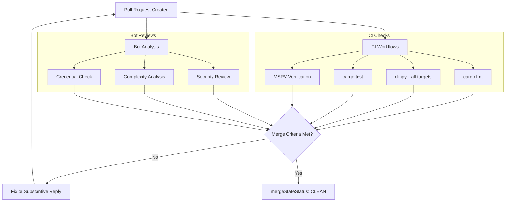

<details>
<summary>Relevant source files</summary>

The following files were used as context for generating this wiki page:

- [REVIEW.md](REVIEW.md)
- [AGENTS.md](AGENTS.md)
- [README.md](README.md)
- [.github/workflows/ci.yml](.github/workflows/ci.yml)
- [codecov.yml](codecov.yml)
</details>

# Automated Bot Rules

Automated Bot Rules govern the interaction, code review standards, and automated feedback mechanisms within the `kinetic-signals` repository. These rules ensure that all contributions meet specific security, complexity, and behavioral standards before being merged into the main codebase.

The system utilizes a variety of specialized bots to perform automated analysis, ranging from security scanning and credential management to architectural consistency checks. This automated layer complements human review by enforcing baseline criteria and reducing manual oversight for common anti-patterns.

Sources: [REVIEW.md:25-33](REVIEW.md#L25-L33), [AGENTS.md:57-65](AGENTS.md#L57-L65)

## Bot Ecosystem and Responsibilities

The project integrates multiple automated tools, each with a defined focus area. These bots provide inline comments on Pull Requests (PRs) and must be addressed according to the repository's response guidelines.

### Primary Review Bots

| Bot | Focus Areas | Common Fixes |
| :--- | :--- | :--- |
| **Codacy** | Security (SHA pinning), code complexity | Pin actions to SHAs, reduce cyclomatic complexity |
| **Devin** | Behavioral consistency, MSRV concerns, caching | Add cargo caching, clarify intentional behavior |
| **CodeRabbit** | Least-privilege permissions, credential security | Add permissions block, set `persist-credentials: false` |
| **Kilo Code** | Code improvements, technical suggestions | Address suggestions with rationale or code fix |
| **Cursor** | Bug detection, security claims verification | Fix identified bugs, verify security claims |

Sources: [REVIEW.md:35-43](REVIEW.md#L35-L43)

### Integration with CI/CD
Automated rules are enforced through GitHub Actions workflows. Bots and CI checks must return success states before a PR is considered eligible for merging.



The diagram shows how PRs are subjected to parallel tracks of CI verification and bot-driven analysis to reach a mergeable state.
Sources: [REVIEW.md:53-60](REVIEW.md#L53-L60), [AGENTS.md:46-55](AGENTS.md#L46-L55)

## Bot Comment Handling Protocol

Strict procedures are defined for how developers must interact with automated feedback. Unlike standard lint warnings, bot comments are treated as active threads that require resolution through either code changes or technical justification.

1.  **Read and Understand**: Analyze the finding provided by the bot.
2.  **Verification**: Determine if the finding is valid against the current state of the code.
3.  **Actionable Fixes**: If valid, the developer should push a fix and reply with the commit SHA.
4.  **Substantive Response**: If the finding is not fixable or intentional, a substantive explanation must be provided. Empty acknowledgments are prohibited.
5.  **Resolution**: The thread must be resolved only after a reply or fix is provided.

Sources: [REVIEW.md:45-51](REVIEW.md#L45-L51)

## Mandatory Merge Criteria

The automated rules culminate in a set of requirements that must be satisfied for any PR. The repository enforces these via GitHub's merge state status and review decisions.

- **CI Success**: All CI checks (fmt, clippy, build, test, cargo audit) must pass without `FAILURE` or `ACTION_REQUIRED` statuses.
- **Clean State**: The `mergeStateStatus` must be `CLEAN` and the PR must be marked as `MERGEABLE`.
- **Zero Unresolved Threads**: Every bot and human thread must be either fixed in code or answered substantively.
- **Approval Decision**: The `reviewDecision` must not be `CHANGES_REQUESTED`.

Sources: [REVIEW.md:53-61](REVIEW.md#L53-L61), [AGENTS.md:88-92](AGENTS.md#L88-L92)

## Workflow Exclusions and Thresholds

To prevent noise and focus analysis on relevant code, specific paths and thresholds are configured for the automated tools.

### Coverage Thresholds
Code coverage is managed via `codecov.yml` and enforced in the `coverage.yml` workflow. The system ignores non-code artifacts and documentation to maintain accurate reporting.

```yaml
ignore:
  - "docs/**"
  - "*.md"
  - ".github/**"
  - "examples/**"
  - "tests/fixtures/**"
```

Sources: [codecov.yml:10-15](codecov.yml#L10-L15), [AGENTS.md:52-53](AGENTS.md#L52-L53)

### Bot Scoping
Bots are instructed to prioritize specific file types based on their impact on the build and security profile of the crate.

| Scoped In | Scoped Out (Ignored) |
| :--- | :--- |
| `src/` (Core logic) | `.beads/`, `.mimocode/`, `.kilo/` |
| `Cargo.toml` (Dependencies) | `.idea/`, `.cursor/`, `.vscode/` |
| `.github/workflows/` (CI/CD) | `Cargo.lock` (for library crate) |
| `Dockerfile` (Containerization) | License text files |

Sources: [REVIEW.md:6-23](REVIEW.md#L6-L23)

## Summary

Automated Bot Rules in the `kinetic-signals` project serve as a first-line defense for code quality and security. By integrating tools like Codacy, CodeRabbit, and Devin, the project enforces a high standard for credential management, dependency security, and code complexity. Compliance with these rules is non-negotiable for merging, ensuring that the library remains performant and domain-agnostic while following Rust best practices.

Sources: [REVIEW.md:53-61](REVIEW.md#L53-L61), [README.md:154-159](README.md#L154-L159)
