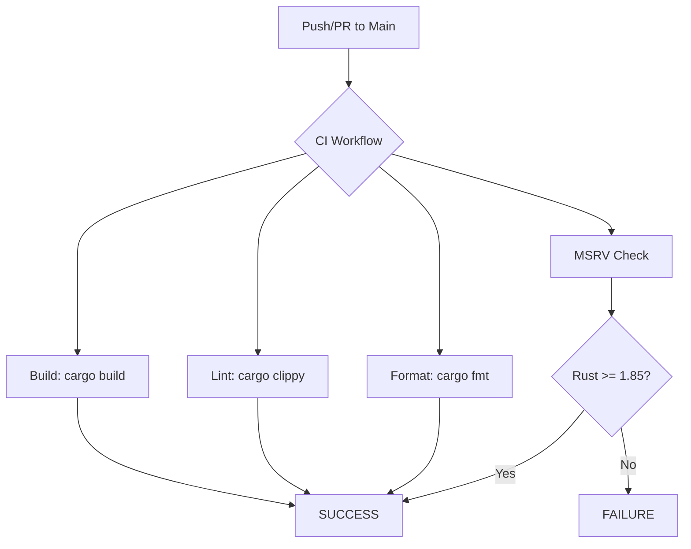

<details>
<summary>Relevant source files</summary>

The following files were used as context for generating this wiki page:

- [AGENTS.md](AGENTS.md)
- [Cargo.toml](Cargo.toml)
- [README.md](README.md)
- [src/lib.rs](src/lib.rs)
- [REVIEW.md](REVIEW.md)
- [tests/sentry_feature.rs](tests/sentry_feature.rs)
</details>

# MSRV & Rust Edition 2024

The `kinetic-signals` crate is built using the Rust **Edition 2024** and maintains a Minimum Supported Rust Version (MSRV) of **1.85.0**. This configuration ensures the library utilizes modern language features and stricter safety guarantees required for high-velocity stochastic signal processing.

The project enforces these toolchain requirements through automated Continuous Integration (CI) workflows, specifically checking for formatting, linting, and MSRV compliance on every push to the main branch.

Sources: [AGENTS.md:38-39](AGENTS.md#L38-L39), [Cargo.toml:3-4](Cargo.toml#L3-L4), [README.md:65-65](README.md#L65)

## Toolchain Specifications

The library's configuration is defined in the package manifest and enforced via CI pipelines to ensure stability and compatibility across development environments.

| Requirement | Value | Purpose |
|-------------|-------|---------|
| **Rust Edition** | 2024 | Modern language features and safety semantics |
| **MSRV** | 1.85.0 | Verified minimum version for compilation and CI |
| **Optimization** | Level 3 | Aggressive optimizations for real-time inference |

The Edition 2024 setting introduces specific behavioral changes, such as marking certain environment variable operations as `unsafe`, which impacts how tests and integrations are authored.

Sources: [Cargo.toml:4-4](Cargo.toml#L4), [Cargo.toml:23-23](Cargo.toml#L23), [AGENTS.md:38-39](AGENTS.md#L38-L39), [AGENTS.md:95-95](AGENTS.md#L95)

### Edition 2024 Safety Implications

Under Edition 2024, `std::env::set_var` and `std::env::remove_var` are considered `unsafe`. To maintain a safe codebase, the project utilizes the `temp-env` crate for environment variable manipulation within test suites. However, reading variables via `std::env::var` remains safe.

```rust
// Example of safe environment reading in lib.rs
pub fn init_sentry() -> Option<sentry::ClientInitGuard> {
    // SAFETY: env::var is safe; only env::set_var/remove_var are unsafe in edition 2024.
    match std::env::var("SENTRY_DSN") {
        Ok(dsn) if !dsn.is_empty() => {
            // ... initialization logic
        }
        _ => None,
    }
}
```

Sources: [src/lib.rs:52-54](src/lib.rs#L52-L54), [AGENTS.md:95-95](AGENTS.md#L95)

## CI/CD Enforcement

The project employs a robust CI strategy to prevent regression of the MSRV and ensure adherence to Edition 2024 standards.



The `ci.yml` workflow specifically executes MSRV checks and no-default-features builds to verify that toolchain requirements are met even in minimal configurations.

Sources: [AGENTS.md:52-57](AGENTS.md#L52-L57), [REVIEW.md:46-46](REVIEW.md#L46)

## Dependency and Feature Compatibility

The MSRV is influenced by both the core library logic and optional features. The `sentry` feature, used for error monitoring, introduces external dependencies that must align with the crate's toolchain requirements.

| Dependency | Version | Requirement |
|------------|---------|-------------|
| `sentry` | 0.48.2 | Feature-gated, requires OpenSSL on some systems |
| `temp-env` | 0.3.6 | Used for safe env testing in Edition 2024 |
| `serial_test`| 3.0 | Used for serial execution of env-sensitive tests |

Sources: [AGENTS.md:44-48](AGENTS.md#L44-L48), [Cargo.toml:11-18](Cargo.toml#L11-L18), [tests/sentry_feature.rs:11-11](tests/sentry_feature.rs#L11)

## Conclusion

By adopting Rust Edition 2024 and an MSRV of 1.85.0, `kinetic-signals` provides a modern, high-performance foundation for signal analysis. The strict enforcement of these versions via CI ensures that the library remains reliable and takes full advantage of the latest improvements in the Rust compiler and ecosystem.
